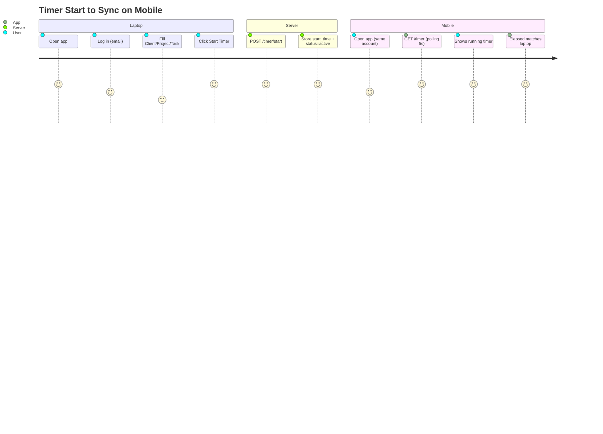
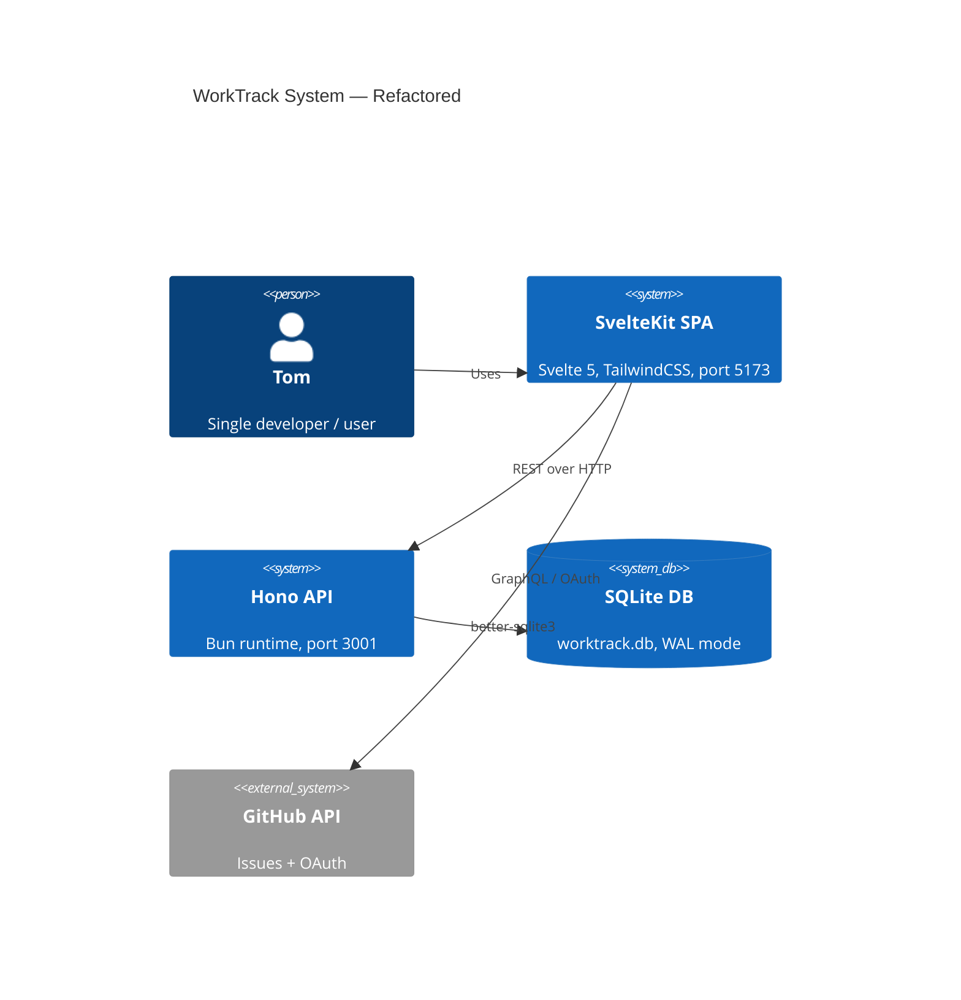
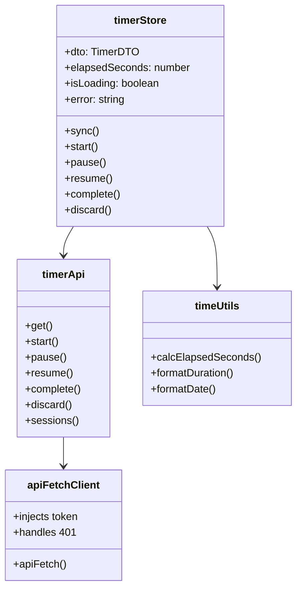

# Feature: WorkTrack Architecture Refactor

**Branch:** `feature/architecture-refactor`  
**Status:** Proposal · Awaiting Approval  
**Complexity:** High  

---

## Brief Description

A full-stack architectural refactor of WorkTrack to resolve timer sync failures, reactive state bugs, SSR hydration issues, and database concurrency problems. The result is a clean, production-grade SPA backed by a SQLite-powered Hono API.

---

## User Story

> As a developer using WorkTrack across my laptop and mobile,  
> I want my timer to stay in sync across devices, survive page refreshes, and never reset unexpectedly,  
> so that my time logs are always accurate and I can trust my recorded hours.

---

## User Benefits

- ⏱ Timer stays accurate across refresh, tab switch, and device change
- 📱 Start on laptop, complete on mobile — state is always consistent  
- 🔐 Auth is validated with the server — no stale token confusion
- ⚡ App feels instant with proper loading/error states
- 🧹 Codebase is maintainable by a single developer long-term

---

## Acceptance Criteria

- [ ] Timer elapsed time is calculated from `startTime` timestamp — never from a counter
- [ ] Starting a timer on Device A shows it running on Device B within 5 seconds
- [ ] Refreshing the page restores the active timer with correct elapsed time
- [ ] `tracker.svelte.ts` is removed and replaced by 3 focused files
- [ ] SSR is disabled; app runs in full SPA mode
- [ ] JSON database is replaced with SQLite
- [ ] All `$effect` calls are side-effect free (no API calls inside effects)
- [ ] Auth is validated via `/auth/me` on startup, not from `!!token`
- [ ] All API calls show a loading indicator
- [ ] Build passes `bun run check` with zero TypeScript errors

---

## Rough Complexity Estimate

**High** — touches every layer of the stack but migration is done in phases with no single "big bang" moment.

---

## 1. High-Level Architecture

```
┌─────────────────────────────────────────────────────────────────┐
│                        BROWSER (SPA Mode)                       │
│                                                                 │
│  ┌──────────┐   ┌──────────────┐   ┌────────────────────────┐  │
│  │  NavBar  │   │  timerStore  │──▶│  timerApi.ts           │  │
│  │ navStore │   │ (reactive    │   │  (fetch wrappers only) │  │
│  └──────────┘   │  state only) │   └───────────┬────────────┘  │
│                 └──────┬───────┘               │               │
│                        │ derives               │ HTTP          │
│                 ┌──────▼───────┐               │               │
│                 │  timeUtils   │               │               │
│                 │ (pure fns)   │               │               │
│                 └──────────────┘               │               │
└────────────────────────────────────────────────┼───────────────┘
                                                 │ REST
┌────────────────────────────────────────────────▼───────────────┐
│                    Hono API (Bun, port 3001)                    │
│                                                                 │
│  /api/auth/*      AuthService (JWT, bcrypt)                    │
│  /api/timer/*     TimerService (conflict check, events)        │
│  /api/sessions/*  SessionService (history, reports)            │
│                          │                                      │
└──────────────────────────┼───────────────────────────────────-─┘
                           │ better-sqlite3
                   ┌───────▼──────────┐
                   │  worktrack.db    │
                   │  (SQLite file)   │
                   └──────────────────┘
```

---

## 2. New Folder Structure

### Frontend (`src/`)

```
src/
├── app.html
├── app.css
├── routes/
│   ├── +layout.ts          ← export const ssr = false  ← KEY CHANGE
│   ├── +layout.svelte      ← auth guard only, no tracker calls
│   ├── +page.svelte        ← thin shell, renders active panel
│   └── login/
│       └── +page.svelte
└── lib/
    ├── api/                ← NEW: pure HTTP fetch functions
    │   ├── timerApi.ts     ← start/stop/get/sessions
    │   ├── authApi.ts      ← login/register/me/logout
    │   └── client.ts       ← base fetch with auth header injection
    │
    ├── stores/             ← LEAN: reactive state only, no fetch
    │   ├── auth.svelte.ts  ← user, token, isAuthenticated
    │   ├── timer.svelte.ts ← activeTimer, sessions, isLoading
    │   └── nav.svelte.ts   ← activeTab (already done)
    │
    ├── utils/              ← NEW: pure functions, zero side effects
    │   └── timeUtils.ts    ← formatDuration, calcElapsed, formatDate
    │
    └── components/
        ├── TimerPanel.svelte
        ├── LogsPanel.svelte
        ├── ReportsPanel.svelte
        └── ...
```

### Backend (`local-server/`)

```
local-server/
├── index.ts            ← Hono app, route registration
├── database.ts         ← SQLite connection + typed query helpers
├── auth.ts             ← AuthService (JWT, bcrypt, user CRUD)
├── timer.ts            ← TimerService (start/stop/pause/events)
├── worktrack.db        ← SQLite file (replaces worktrack-data.json)
└── schema.sql          ← Source-of-truth schema
```

---

## 3. Database Schema (SQLite)

```sql
-- schema.sql

PRAGMA journal_mode = WAL;    -- concurrent read safety
PRAGMA foreign_keys = ON;

CREATE TABLE IF NOT EXISTS users (
  id           INTEGER PRIMARY KEY AUTOINCREMENT,
  username     TEXT    NOT NULL UNIQUE,
  email        TEXT    UNIQUE,
  password_hash TEXT,
  github_id    TEXT    UNIQUE,
  google_id    TEXT    UNIQUE,
  avatar_url   TEXT,
  created_at   TEXT    NOT NULL DEFAULT (datetime('now'))
);

CREATE TABLE IF NOT EXISTS timer_sessions (
  id               INTEGER PRIMARY KEY AUTOINCREMENT,
  user_id          INTEGER NOT NULL REFERENCES users(id) ON DELETE CASCADE,
  client           TEXT    NOT NULL,
  project          TEXT    NOT NULL,
  task             TEXT    NOT NULL,
  status           TEXT    NOT NULL CHECK (status IN ('active','paused','completed','discarded')),
  start_time       TEXT    NOT NULL,              -- ISO 8601
  end_time         TEXT,                          -- NULL while running
  total_elapsed_s  INTEGER NOT NULL DEFAULT 0,   -- seconds accumulated (pauses excluded)
  device_info      TEXT,                          -- JSON blob
  created_at       TEXT    NOT NULL DEFAULT (datetime('now')),
  updated_at       TEXT    NOT NULL DEFAULT (datetime('now'))
);

CREATE TABLE IF NOT EXISTS timer_events (
  id          INTEGER PRIMARY KEY AUTOINCREMENT,
  session_id  INTEGER NOT NULL REFERENCES timer_sessions(id) ON DELETE CASCADE,
  event_type  TEXT    NOT NULL CHECK (event_type IN ('start','pause','resume','complete','discard')),
  timestamp   TEXT    NOT NULL DEFAULT (datetime('now')),
  device_info TEXT
);

-- Indexes
CREATE INDEX IF NOT EXISTS idx_sessions_user_status
  ON timer_sessions (user_id, status);

CREATE INDEX IF NOT EXISTS idx_events_session
  ON timer_events (session_id);
```

**Why SQLite over PostgreSQL?**

| | SQLite | PostgreSQL |
|---|---|---|
| Setup | Zero config, single file | Requires install + process |
| Single dev, local | ✅ Perfect | Overkill |
| Concurrency | WAL mode handles reads fine | Better under high write load |
| Migrate to Postgres later | Easy (schema is portable) | N/A |
| **Verdict** | **✅ Use SQLite now** | If you go multi-user/cloud |

---

## 4. API Contract

### Auth

```http
POST /api/auth/login-email
{ "email": "tom@example.com", "password": "secret" }
→ 200 { "access_token": "eyJ...", "user": { "id": 1, "username": "tom", ... } }
→ 401 { "error": "Invalid credentials" }

GET /api/auth/me
Authorization: Bearer <token>
→ 200 { "user": { "id": 1, "username": "tom", "avatar_url": "..." } }
→ 401 { "error": "Unauthorized" }

POST /api/auth/logout
Authorization: Bearer <token>
→ 204
```

### Timer

```http
GET /api/timer
Authorization: Bearer <token>
→ 200 {
    "timer": {
      "id": 42,
      "status": "active",        -- "active" | "paused" | null
      "client": "Acme",
      "project": "Website",
      "task": "Fix navbar",
      "start_time": "2026-05-05T10:00:00.000Z",  -- wall-clock start
      "total_elapsed_s": 1820     -- seconds accumulated before last start
    }
  }
→ 200 { "timer": null }          -- no active session

POST /api/timer/start
Authorization: Bearer <token>
{ "client": "Acme", "project": "Website", "task": "Fix navbar" }
→ 201 { "timer": { ...above shape... } }
→ 409 { "error": "CONFLICT", "timer": { ...conflicting session... } }

POST /api/timer/pause
Authorization: Bearer <token>
→ 200 { "timer": { ...with status: "paused", total_elapsed_s updated... } }

POST /api/timer/resume
Authorization: Bearer <token>
→ 200 { "timer": { ...with status: "active", fresh start_time... } }
→ 409 { "error": "CONFLICT" }

POST /api/timer/complete
Authorization: Bearer <token>
→ 200 { "session": { ...completed session with end_time... } }

DELETE /api/timer
Authorization: Bearer <token>
→ 204

GET /api/sessions?limit=50&offset=0
Authorization: Bearer <token>
→ 200 { "sessions": [...], "total": 142 }
```

---

## 5. Refactored Frontend Store Examples

### `src/lib/api/client.ts` — Base fetch

```typescript
import { authStore } from '$lib/stores/auth.svelte';

const BASE = () =>
  typeof window !== 'undefined'
    ? `http://${window.location.hostname}:3001/api`
    : 'http://localhost:3001/api';

export async function apiFetch<T>(
  path: string,
  options: RequestInit = {}
): Promise<T> {
  const token = authStore.token;
  const res = await fetch(`${BASE()}${path}`, {
    ...options,
    headers: {
      'Content-Type': 'application/json',
      ...(token ? { Authorization: `Bearer ${token}` } : {}),
      ...options.headers
    }
  });

  if (res.status === 401) {
    authStore.logout();
    throw new Error('SESSION_EXPIRED');
  }

  if (!res.ok) {
    const body = await res.json().catch(() => ({}));
    throw new Error(body.error || `HTTP ${res.status}`);
  }

  if (res.status === 204) return undefined as T;
  return res.json() as Promise<T>;
}
```

### `src/lib/api/timerApi.ts` — Pure API calls

```typescript
import { apiFetch } from './client';

export interface TimerDTO {
  id: number;
  status: 'active' | 'paused';
  client: string;
  project: string;
  task: string;
  start_time: string;       // ISO — wall-clock when current run started
  total_elapsed_s: number;  // accumulated seconds from previous runs
}

export const timerApi = {
  get: () =>
    apiFetch<{ timer: TimerDTO | null }>('/timer'),

  start: (client: string, project: string, task: string) =>
    apiFetch<{ timer: TimerDTO }>('/timer/start', {
      method: 'POST',
      body: JSON.stringify({ client, project, task })
    }),

  pause: () =>
    apiFetch<{ timer: TimerDTO }>('/timer/pause', { method: 'POST' }),

  resume: () =>
    apiFetch<{ timer: TimerDTO }>('/timer/resume', { method: 'POST' }),

  complete: () =>
    apiFetch<{ session: object }>('/timer/complete', { method: 'POST' }),

  discard: () =>
    apiFetch<void>('/timer', { method: 'DELETE' }),

  sessions: (limit = 50) =>
    apiFetch<{ sessions: object[] }>(`/sessions?limit=${limit}`)
};
```

### `src/lib/utils/timeUtils.ts` — Pure functions

```typescript
/**
 * Calculate LIVE elapsed seconds from a server TimerDTO.
 * Works identically on every device because it uses wall-clock math.
 */
export function calcElapsedSeconds(timer: {
  start_time: string;
  total_elapsed_s: number;
  status: 'active' | 'paused';
}): number {
  if (timer.status === 'paused') {
    return timer.total_elapsed_s;
  }
  const runningSeconds = Math.floor(
    (Date.now() - new Date(timer.start_time).getTime()) / 1000
  );
  return timer.total_elapsed_s + runningSeconds;
}

export function formatDuration(totalSeconds: number): string {
  const h = Math.floor(totalSeconds / 3600);
  const m = Math.floor((totalSeconds % 3600) / 60);
  const s = totalSeconds % 60;
  return [h, m, s].map((v) => String(v).padStart(2, '0')).join(':');
}

export function formatDate(iso: string): string {
  return new Date(iso).toLocaleDateString(undefined, {
    month: 'short', day: 'numeric', year: 'numeric'
  });
}
```

### `src/lib/stores/timer.svelte.ts` — Lean reactive state

```typescript
import { timerApi, type TimerDTO } from '$lib/api/timerApi';
import { calcElapsedSeconds } from '$lib/utils/timeUtils';

function createTimerStore() {
  let dto = $state<TimerDTO | null>(null);   // raw server data
  let isLoading = $state(false);
  let error = $state<string | null>(null);
  let _tick = $state(0);                     // increments every second for reactivity

  let _intervalId: ReturnType<typeof setInterval> | null = null;

  function startTick() {
    if (_intervalId) return;
    _intervalId = setInterval(() => { _tick++; }, 1000);
  }

  function stopTick() {
    if (_intervalId) { clearInterval(_intervalId); _intervalId = null; }
  }

  async function sync() {
    try {
      const res = await timerApi.get();
      dto = res.timer;
      if (dto?.status === 'active') startTick(); else stopTick();
    } catch (e) {
      // silent fail — UI will show stale data
    }
  }

  async function start(client: string, project: string, task: string) {
    isLoading = true; error = null;
    try {
      const res = await timerApi.start(client, project, task);
      dto = res.timer;
      startTick();
    } catch (e) {
      error = (e as Error).message;
    } finally {
      isLoading = false;
    }
  }

  async function pause() {
    isLoading = true;
    try { const res = await timerApi.pause(); dto = res.timer; stopTick(); }
    catch (e) { error = (e as Error).message; }
    finally { isLoading = false; }
  }

  async function resume() {
    isLoading = true; error = null;
    try { const res = await timerApi.resume(); dto = res.timer; startTick(); }
    catch (e) { error = (e as Error).message; }
    finally { isLoading = false; }
  }

  async function complete() {
    isLoading = true;
    try { await timerApi.complete(); dto = null; stopTick(); }
    catch (e) { error = (e as Error).message; }
    finally { isLoading = false; }
  }

  async function discard() {
    isLoading = true;
    try { await timerApi.discard(); dto = null; stopTick(); }
    catch (e) { error = (e as Error).message; }
    finally { isLoading = false; }
  }

  return {
    get dto() { return dto; },
    get isLoading() { return isLoading; },
    get error() { return error; },
    // Derived: live elapsed seconds. _tick dependency makes this
    // re-compute every second automatically.
    get elapsedSeconds() {
      void _tick;
      return dto ? calcElapsedSeconds(dto) : 0;
    },
    get isRunning() { return dto?.status === 'active'; },
    get isPaused() { return dto?.status === 'paused'; },
    sync, start, pause, resume, complete, discard,
    destroy: stopTick
  };
}

export const timerStore = createTimerStore();
```

---

## 6. Timer Logic — Core Implementation

### Why setInterval is Wrong

```
Device A starts timer at 10:00:00
setInterval increments a counter every 1s

Device B opens app at 10:05:00
→ counter = 0 (Device B has no shared counter)
→ shows 00:00:00 ❌

Device A's browser tab sleeps for 2 minutes
→ setInterval pauses/throttles in background tabs
→ counter is 1m40s behind ❌
```

### Why `startTime + totalElapsed` is Correct

```
Server stores: { start_time: "10:00:00", total_elapsed_s: 0 }

Device A at 10:05:00: elapsed = (10:05 - 10:00) + 0 = 300s ✅
Device B at 10:05:00: elapsed = (10:05 - 10:00) + 0 = 300s ✅
After pause: server stores total_elapsed_s = 300 (frozen)
After resume: server sets fresh start_time, total_elapsed_s stays 300
Device C at 10:10:00: elapsed = (10:10 - resume_time) + 300 ✅
```

### Backend `pauseTimer` update (key part)

```typescript
// In timer.ts — server side
async pauseTimer(userId: number): Promise<TimerSession> {
  const session = db.getActiveTimerForUser(userId);
  if (!session) throw new Error('No active timer');

  const now = new Date();
  const runningSeconds = Math.floor(
    (now.getTime() - new Date(session.start_time).getTime()) / 1000
  );
  const newTotal = session.total_elapsed_s + runningSeconds;

  return db.updateTimerSession(session.id, {
    status: 'paused',
    total_elapsed_s: newTotal,   // frozen at this value
    updated_at: now.toISOString()
  });
}

async resumeTimer(userId: number): Promise<TimerSession> {
  const session = db.getPausedTimerForUser(userId);
  if (!session) throw new Error('No paused timer');

  return db.updateTimerSession(session.id, {
    status: 'active',
    start_time: new Date().toISOString(),   // fresh wall-clock anchor
    // total_elapsed_s stays unchanged — carries over paused time
    updated_at: new Date().toISOString()
  });
}
```

---

## 7. Real-time Sync: Polling vs WebSocket

### Recommendation: **Polling** (for now)

| | Polling | WebSocket |
|---|---|---|
| Implementation | 5 lines | ~100 lines + server changes |
| Reliability | Excellent | Needs reconnect logic |
| Battery (mobile) | Good at 5s interval | Marginally better |
| Fits 1 developer | ✅ Yes | ⚠️ Extra complexity |
| Good enough for sync? | ✅ Yes (5s delay acceptable) | Better for real-time collab |

### Polling Implementation (minimal)

```typescript
// In +layout.svelte — runs inside component (valid $effect context)
$effect(() => {
  if (!authStore.isAuthenticated) return;

  const id = setInterval(() => {
    timerStore.sync();
  }, 5000);   // sync every 5 seconds

  // Immediate sync on window focus
  const onFocus = () => timerStore.sync();
  window.addEventListener('focus', onFocus);

  return () => {
    clearInterval(id);
    window.removeEventListener('focus', onFocus);
  };
});
```

> When you outgrow polling: add `GET /api/timer/stream` as a Server-Sent Events endpoint.
> The frontend just changes `setInterval` → `new EventSource(...)`. Zero backend rewrite.

---

## 8. Disabling SSR (SPA Mode)

```typescript
// src/routes/+layout.ts  (NEW FILE — just 2 lines)
export const ssr = false;
export const prerender = false;
```

**What this eliminates immediately:**
- `if (browser)` guards in every store file
- `tracker.init()` running on the server
- Hydration mismatch warnings
- `API_BASE` needing SSR-safe conditional
- `$effect` orphan errors from module-level calls

---

## TDD Test Cases

### Timer Logic (Unit)
```
1. calcElapsedSeconds — active timer returns wall-clock diff + accumulated
2. calcElapsedSeconds — paused timer returns only total_elapsed_s (frozen)
3. calcElapsedSeconds — handles resume after pause correctly
4. formatDuration — 3661 → "01:01:01"
5. formatDuration — 0 → "00:00:00"
```

### API Layer (Integration)
```
6. timerApi.start — calls POST /timer/start with correct body
7. timerApi.start — throws on 409 CONFLICT
8. apiFetch — calls authStore.logout() on 401
9. apiFetch — injects Authorization header when token exists
```

### Store (Component)
```
10. timerStore.start → sets dto, calls startTick
11. timerStore.complete → sets dto to null, calls stopTick
12. timerStore.elapsedSeconds → recalculates when _tick changes
13. timerStore.sync → updates dto from API response
```

---

## Mermaid Diagrams

### User Journey


### System Architecture


### Module Structure


---

## 9. Migration Plan (7 Phases, Minimal Breakage)

Each phase is independently deployable. Roll back any phase without affecting others.

### Phase 1 — Disable SSR (30 min, zero risk)
```
□ Create src/routes/+layout.ts with ssr = false
□ Remove all if (browser) guards from stores
□ Run bun run check — fix any TS errors
□ Test: all panels still work
```

### Phase 2 — Extract timeUtils.ts (1 hour)
```
□ Create src/lib/utils/timeUtils.ts
□ Move formatDuration, calcElapsed from tracker.svelte.ts
□ Update all imports
□ Run unit tests
```

### Phase 3 — Extract timerApi.ts + authApi.ts (2 hours)
```
□ Create src/lib/api/client.ts (apiFetch base)
□ Create src/lib/api/timerApi.ts (all timer fetch calls)
□ Create src/lib/api/authApi.ts (all auth fetch calls)
□ Remove fetch calls from tracker.svelte.ts and auth.svelte.ts
□ Test: login, start timer, complete timer still work
```

### Phase 4 — New timerStore (2 hours)
```
□ Create src/lib/stores/timer.svelte.ts (new lean store)
□ Keep tracker.svelte.ts as-is initially (parallel run)
□ Migrate TimerPanel.svelte to use new timerStore
□ Test: TimerPanel works with new store
□ Delete tracker.svelte.ts
```

### Phase 5 — SQLite migration (2 hours)
```
□ Install: bun add better-sqlite3 @types/better-sqlite3
□ Create local-server/schema.sql
□ Create new local-server/database.ts (SQLite version)
□ Migrate worktrack-data.json data to SQLite (one-time script)
□ Update TimerService to use new DB
□ Test: start/pause/complete timer with SQLite backend
```

### Phase 6 — Timestamp-based timer (2 hours)
```
□ Update timer.ts pauseTimer to calc + freeze total_elapsed_s
□ Update timer.ts resumeTimer to set fresh start_time
□ Update GET /timer to return start_time + total_elapsed_s
□ Update timerStore to use calcElapsedSeconds (timeUtils)
□ Remove setInterval counter from timerStore (keep _tick interval only)
□ Test: elapsed time matches across two browser tabs
```

### Phase 7 — Polling sync (1 hour)
```
□ Add setInterval(timerStore.sync, 5000) in +layout.svelte $effect
□ Add window.addEventListener('focus', timerStore.sync) in same effect
□ Test: open on mobile, start on laptop, mobile shows timer in ≤5s
□ Test: focus laptop window while timer running on mobile — syncs instantly
```

**Total estimated time:** ~12 hours across the phases  
**Risk level:** Low — each phase is testable in isolation

---

## Key Design Decisions

| Decision | Rationale |
|---|---|
| SQLite over PostgreSQL | Zero config, single file, WAL handles concurrent reads, portable schema |
| Polling over WebSocket | 5 lines vs ~100, perfectly adequate for 1-2 devices, easy to upgrade later |
| Disable SSR | App has no public pages, no SEO — SSR adds complexity with zero benefit |
| `_tick` pattern in store | The interval only increments a counter; `elapsedSeconds` is derived from timestamps. The UI stays reactive without any mutable time counter |
| API layer separate from store | Store has zero async code — all effects are predictable, testable, and never cause reactive cascades |
