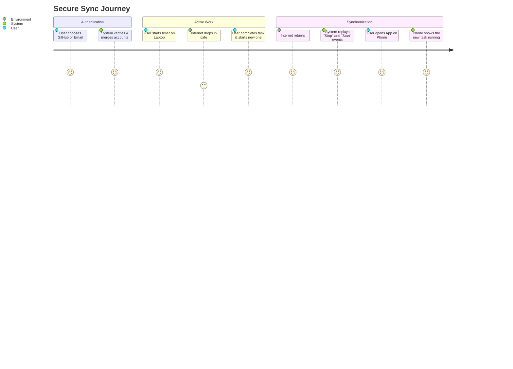
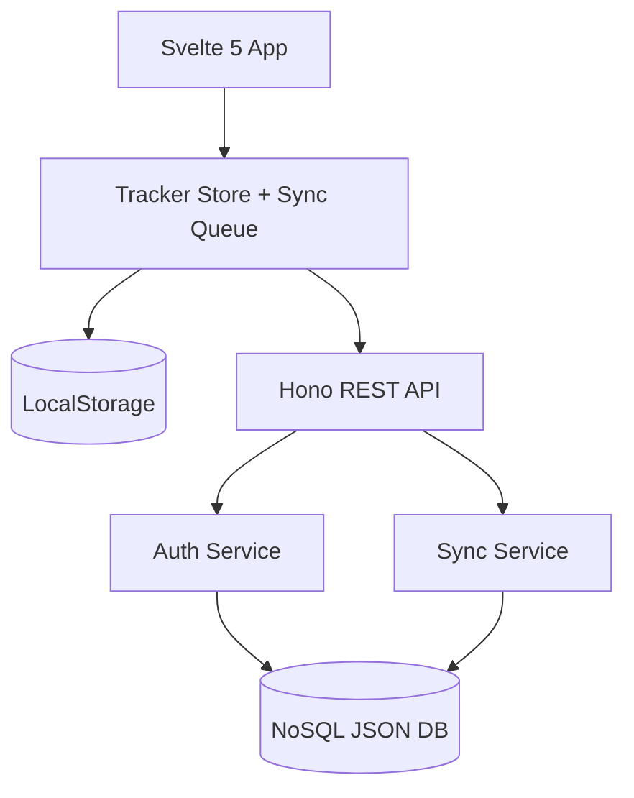
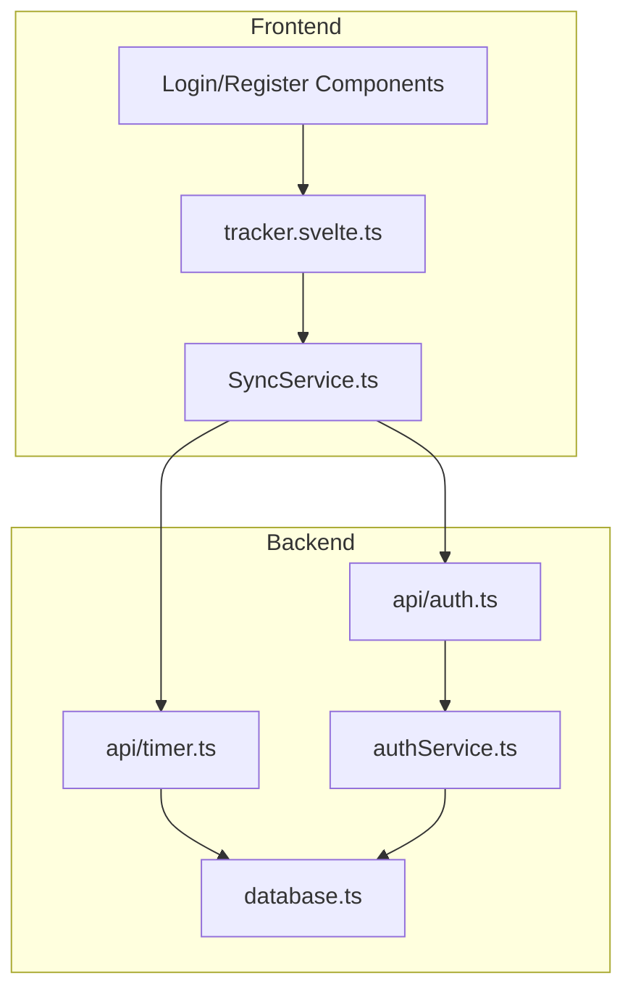

# Feature: Authentication & Resilient Sync System

## Description
A premium, multi-tenant authentication and synchronization system that provides secure access via GitHub OAuth or traditional Email/Password. The system features a "Resilient Sync" engine that ensures data integrity across devices and browsers, even with intermittent internet or system clock changes, using a monotonic "Stopwatch" synchronization strategy and a NoSQL document-based backend.

## User Story
As a user working across multiple devices (Laptop, Phone, Tablet), I want a unique login that keeps my timers perfectly in sync. I want to be able to start work on one device and see it reflected on another instantly, and if I lose internet, I want my progress to be saved locally and "replayed" to the server accurately without worrying about my device's clock settings.

## User Benefits
- **Identity Flexibility**: Use GitHub for speed or Email for privacy/independence.
- **Data Continuity**: Your work sessions are never lost, even if you switch browsers or clear cache.
- **Reliable Accuracy**: Timers remain accurate even if you travel between timezones or change your system time.
- **Zero-Friction Sync**: Automatic merging of accounts based on verified email addresses.

## Acceptance Criteria
- [ ] Support for **GitHub OAuth** login.
- [ ] Support for **Email/Password** registration and login.
- [ ] **Account Merging**: Automatically link GitHub and Email profiles sharing the same verified email.
- [ ] **NoSQL Persistence**: Store all user and session data in a document-based JSON structure on the server.
- [ ] **Resilient Sync**: Use monotonic clock offsets (`performance.now()`) for offline actions to bypass system clock skew.
- [ ] **Conflict Detection**: Server-side enforcement of one active timer per user with a "Conflict Resolution" UI.
- [ ] **Heartbeat Sync**: Periodic background synchronization to keep multi-tab/multi-device states aligned.

## Rough Complexity Estimate
**High** (Due to the complexity of the monotonic sync logic and multi-provider auth handling).

## TDD Test Cases
1. **Auth Merging**: Register with Email `tom@example.com`, then login with GitHub using the same email. Verify both share the same User ID and data.
2. **Clock Skew Resilience**: Start a timer offline, change the laptop's system clock forward 2 hours, stop the timer 5 minutes later. Verify the server records exactly 5 minutes of duration.
3. **Multi-Device Conflict**: Start a timer on Device A. On Device B, attempt to start a different timer. Verify the server returns a 409 Conflict and Device B shows the "Active elsewhere" warning.
4. **Offline Replay**: Record 3 actions (Start, Pause, Resume) while offline. Reconnect and verify the server receives and processes them in the correct sequential order.

## Diagrams

### User Journey (Resilient Sync)

### System Placement

### Module Structure

