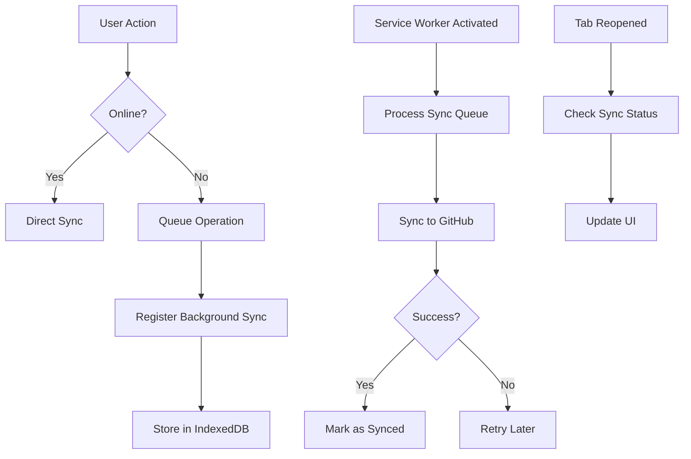
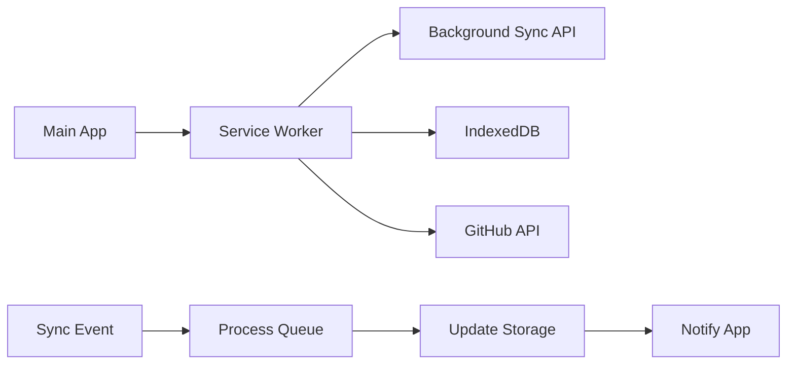
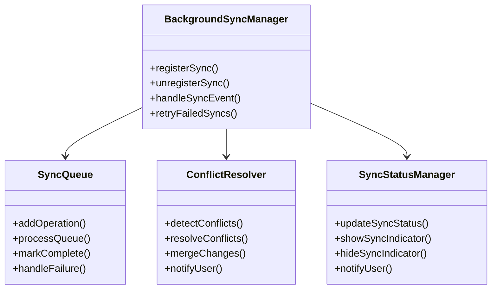

# Feature: Background Sync Data

## Description
Implement background data synchronization using the Background Sync API to automatically sync time entries and GitHub operations when the application comes back online, ensuring data integrity even when the user closes the tab.

## User Story
As a user, I want my time tracking data to automatically sync with GitHub in the background when I regain internet connectivity, so that I don't have to manually trigger sync operations and my data stays up-to-date.

## User Benefits
- Automatic data synchronization without user intervention
- Reliable data sync even when browser tab is closed
- Improved data integrity and consistency
- Reduced manual sync requirements
- Better offline-to-online transition experience

## Acceptance Criteria
- [ ] Background Sync API registration for time entries
- [ ] Background sync for GitHub issue operations
- [ ] Sync queue management for offline operations
- [ ] Automatic retry mechanism for failed syncs
- [ ] Sync status indicators and notifications
- [ ] Conflict resolution for concurrent modifications
- [ ] Graceful fallback when Background Sync API unavailable
- [ ] Periodic sync for long-running offline sessions

## Rough Complexity Estimate
High

## TDD Test Cases
1. **Background Sync Registration**: Verify background sync is properly registered
2. **Offline Queue Processing**: Verify queued operations sync in background
3. **Sync Retry Logic**: Verify failed syncs are retried appropriately
4. **Conflict Resolution**: Verify sync conflicts are resolved correctly
5. **Fallback Behavior**: Verify fallback when Background Sync API unavailable
6. **Tab Closure Sync**: Verify sync works after tab closure and reopening

## Mermaid Diagrams

### Background Sync Flow

### Service Worker Integration

### Module Structure

