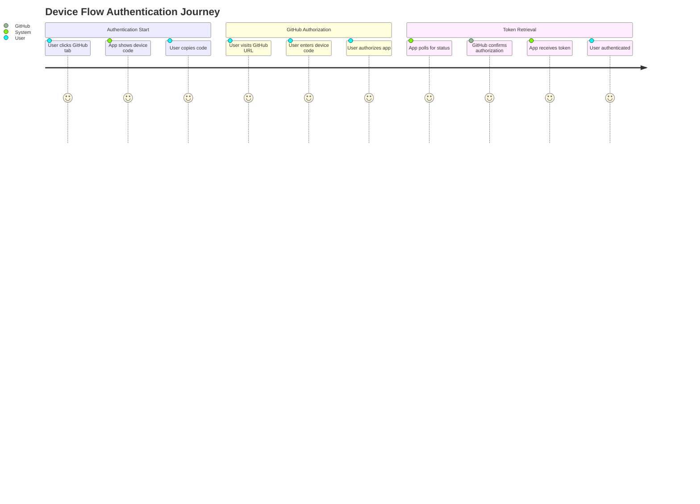
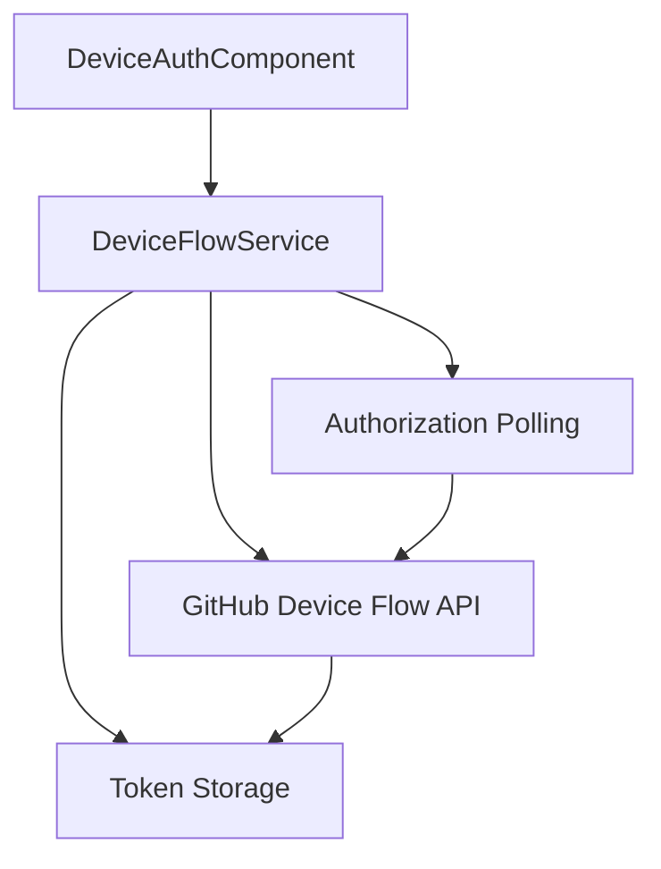
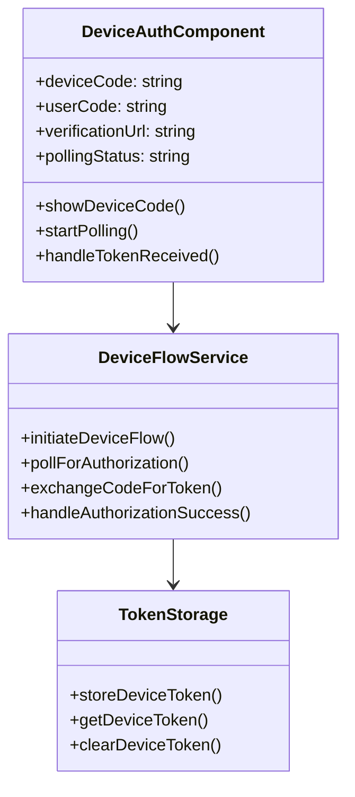

# Feature: Device Flow Authentication

## Description
Implement GitHub Device Flow authentication to eliminate the need for users to copy-paste Personal Access Tokens. Users will only need to enter a short code displayed on their device.

## User Story
As a user, I want to authenticate with GitHub by entering a short device code instead of copying and pasting a long Personal Access Token, so that the authentication process is simpler and more secure.

## User Benefits
- Simplified authentication process - no need to generate and copy long tokens
- Enhanced security - tokens are handled automatically by the device flow
- Better mobile experience - easier to enter short codes on mobile devices
- Reduced user errors - no token formatting issues

## Acceptance Criteria
- [ ] GitHub Device Flow API integration implemented
- [ ] User sees a short code (8-digit) on the authentication screen
- [ ] User is redirected to GitHub to authorize the device
- [ ] Application polls GitHub for authorization status
- [ ] Automatic token retrieval and storage upon authorization
- [ ] Fallback to PAT input if device flow fails
- [ ] Clear instructions and progress indicators during device flow

## Rough Complexity Estimate
Medium-High

## TDD Test Cases
1. **Device Code Generation**: Verify that device code is properly generated and displayed
2. **Authorization Polling**: Verify that the app polls GitHub for authorization status
3. **Token Retrieval**: Verify that tokens are automatically retrieved and stored
4. **Error Handling**: Verify proper handling of expired device codes and authorization failures
5. **Fallback Flow**: Verify that PAT input is available as fallback option

## Mermaid Diagrams

### User Journey

### System Placement

### Module Structure

