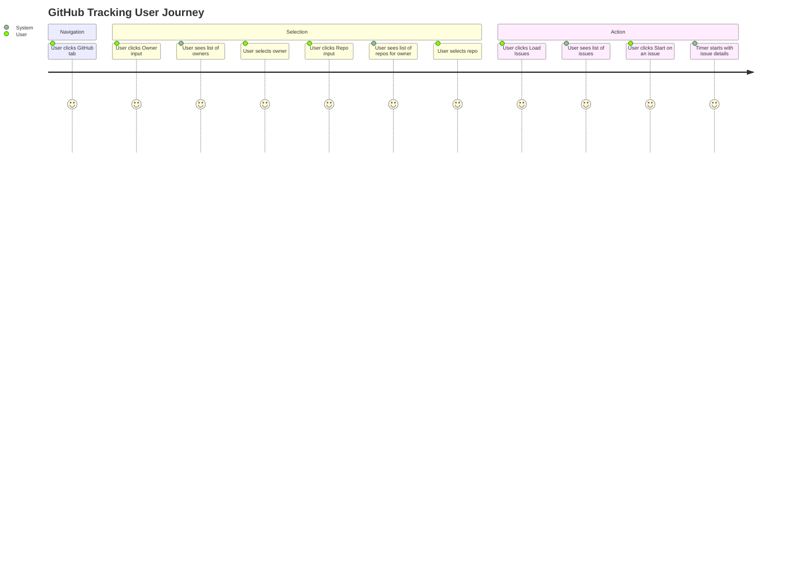
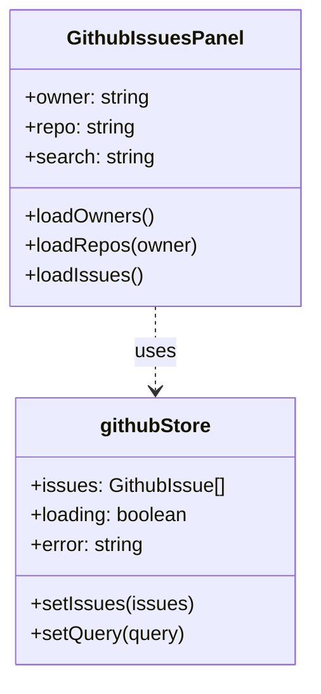

# Feature: Fix GitHub Panel UI

## Description
Improve the GitHub Tracking panel UI by fixing dark mode visibility issues, ensuring owner and repository lists are correctly displayed, and enhancing the overall aesthetics to match the rest of the application.

## User Story
As a user, I want to easily search and track GitHub issues in both light and dark modes, with functional autocomplete for owners and repositories, so that I can manage my tasks efficiently.

## User Benefits
- Improved visibility in dark mode.
- Seamless selection of GitHub owners and repositories.
- Consistent and premium UI experience across all panels.

## Acceptance Criteria
- [ ] Inputs in GitHub panel are clearly visible and readable in dark mode.
- [ ] Owner selection uses a custom, attractive searchable dropdown that works on click.
- [ ] Repository selection uses a custom, attractive searchable dropdown that works on click.
- [ ] GitHub issues are displayed in a modern, attractive layout matching the Timer panel.
- [ ] "Add GitHub Task" button and modal are consistently styled.

## Rough Complexity Estimate
Low-Medium

## TDD Test Cases
1. **Dark Mode Visibility**: Verify that input text is readable when the `dark` class is present on the document.
2. **Owner List Population**: Verify that `loadOwners` fetches and populates the `owners` array.
3. **Repo List Population**: Verify that `loadRepos` fetches and populates the `repos` array when an owner is selected.
4. **Layout Consistency**: Verify that the panel uses the same glassmorphism and card styles as the Timer panel.

## Mermaid Diagrams

### User Journey


### System Placement
```mermaid
graph TD
    UI[GitHubIssuesPanel] --> Store[githubStore]
    UI --> Tracker[tracker store]
    UI --> API_Owners[/api/github/options/owners]
    UI --> API_Repos[/api/github/options/repos]
    UI --> API_Issues[/api/github/issues]
    API_Owners --> GH[gh cli / git]
    API_Repos --> GH
    API_Issues --> GH
```

### Module Structure

