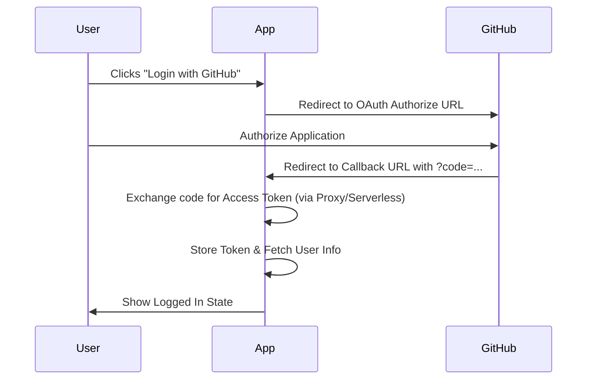
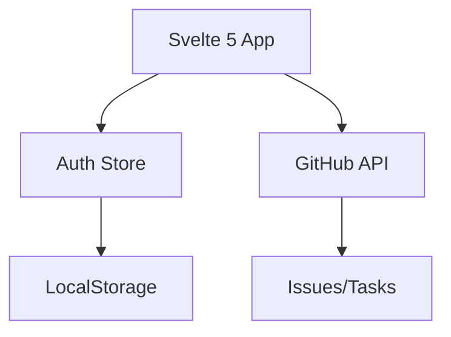

# Feature: GitHub OAuth Integration & Project Cleanup

## Description
Replace GitHub CLI dependency with a standard OAuth 2.0 flow for authentication. This allows users to log in directly via the browser and enables the application to interact with the GitHub API (fetching issues/tasks) using the resulting access token. Additionally, remove boilerplate demo code to streamline the project.

## User Story
As a developer (Tom), I want to log into my work tracker using my GitHub account so that my tasks (GitHub Issues) can be synced automatically without needing the GitHub CLI installed on my machine.

## User Benefits
- **No CLI dependency**: Works entirely in the browser.
- **Security**: Uses standard OAuth 2.0 flow.
- **Efficiency**: Direct integration with GitHub Issues as tasks.
- **Cleanliness**: Removed unused demo features and boilerplate.

## Acceptance Criteria
- [ ] OAuth "Login with GitHub" button in the navigation bar.
- [ ] Successful redirection to GitHub and back to the app with an authorization code.
- [ ] Secure storage of the access token in `localStorage` via a Svelte store.
- [ ] Ability to fetch GitHub issues and use them as tasks in the tracker.
- [ ] Handling of expired or invalid tokens (logout/re-login).
- [ ] Removal of `src/routes/demo` and `src/lib/vitest-examples`.

## Complexity Estimate
Medium-High (due to OAuth callback handling and API integration).

## TDD Test Cases
1. **Auth Store Test**: Verify that setting a token updates the `isAuthenticated` state.
2. **Token Persistence**: Verify token survives page reload.
3. **API Integration**: Mock GitHub API response and verify issues are loaded into the tracker.

## Diagrams

### User Journey (OAuth Flow)

### System Placement

