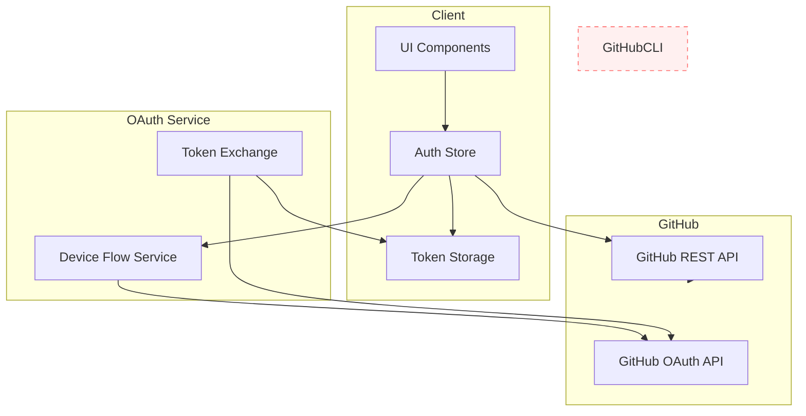
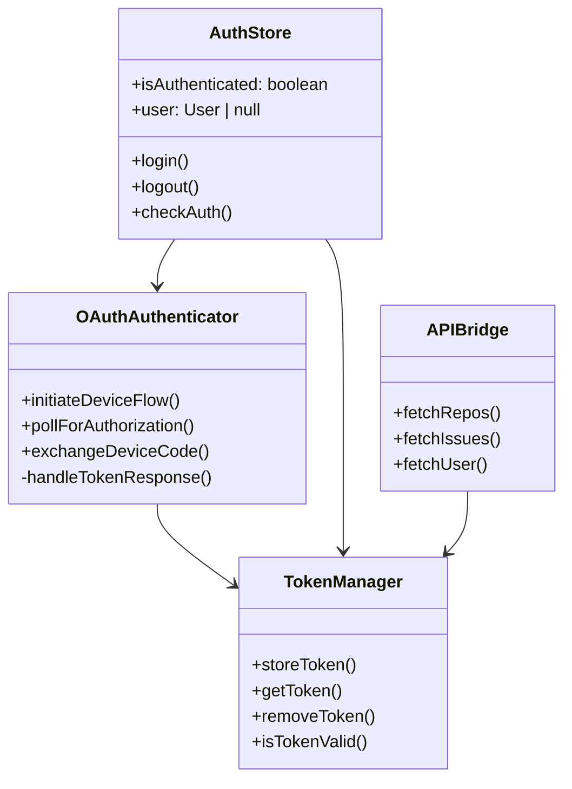

# Feature: GitHub OAuth Refactor

## Description

Refactor the time tracker app to replace GitHub CLI commands with standard OAuth authentication. Users will log in via browser, with the resulting token stored securely on the client side for API calls.

## User Story

As a user, I want to authenticate with GitHub using a standard OAuth flow in my browser instead of relying on the GitHub CLI, so that the authentication is simpler, more reliable, and doesn't require CLI installation or manual token management.

## User Benefits

- **Simpler authentication** - No need to install or configure GitHub CLI
- **Standard OAuth experience** - Familiar browser-based login flow
- **Automatic token management** - Tokens handled automatically by OAuth flow
- **Better security** - No manual token copy-paste, tokens stored securely
- **Cross-platform** - Works on any device with a browser, no CLI dependencies

## Acceptance Criteria

- [ ] OAuth 2.0 device flow implemented for browser-based authentication
- [ ] GitHub CLI endpoints deprecated/removed from codebase
- [ ] Secure token storage using httpOnly cookies or session storage
- [ ] Token refresh flow handled (if applicable)
- [ ] All existing GitHub API functionality migrated to OAuth tokens
- [ ] Fallback to manual PAT input for users without OAuth capability
- [ ] OAuth configuration documented (CLIENT_ID setup)
- [ ] Unit tests for new OAuth components
- [ ] E2E tests for authentication flow

## Rough Complexity Estimate

Medium

## TDD Test Cases

### OAuth Flow Tests

1. **Device Code Request**: Verify device code is generated correctly from GitHub
2. **Token Exchange**: Verify access token is received and stored after authorization
3. **Token Refresh**: Verify expired tokens are refreshed (if applicable)
4. **Logout**: Verify tokens are cleared on logout

### API Integration Tests

5. **Token Injection**: Verify OAuth tokens are injected into API requests
6. **Auth Error Handling**: Verify 401 responses trigger re-authentication
7. **API Calls with Token**: Verify repos, issues, and user data can be fetched

### CLI Deprecation Tests

8. **CLI Removal**: Verify CLI endpoints are no longer called
9. **Fallback PAT**: Verify manual PAT input still works as fallback

## Mermaid Diagrams

### User Journey


### System Architecture



### Module Structure



## Implementation Phases

### Phase 1: OAuth Core

1. Configure GitHub OAuth App credentials
2. Enhance `device-flow.ts` with proper CLIENT_ID handling
3. Add server-side OAuth endpoints for security
4. Implement secure token storage

### Phase 2: CLI Deprecation

1. Mark CLI endpoints as deprecated
2. Add logging/warnings for CLI usage
3. Remove CLI dependencies from API bridge
4. Clean up CLI-related code

### Phase 3: UI/UX

1. Update auth modal with OAuth flow
2. Add "Login with GitHub" button
3. Improve error messages for OAuth failures
4. Add re-authentication flow for expired tokens

### Phase 4: Testing & Polish

1. Add unit tests for OAuth components
2. Add E2E tests for auth flow
3. Update documentation
4. Performance optimization

## Files to Modify

### New Files

- `src/lib/github/oauth-client.ts` - OAuth client wrapper
- `src/lib/server/oauth-endpoints.ts` - Server-side OAuth handlers
- `src/lib/auth/oauth-store.svelte.ts` - Reactive auth store

### Modified Files

- `src/lib/github/device-flow.ts` - Enhance with server-side support
- `src/lib/github/auth.ts` - Update token storage
- `src/lib/github/api.ts` - Ensure OAuth token injection
- `src/lib/components/DeviceAuthModal.svelte` - Update UI
- `src/lib/stores/github.svelte.ts` - Update GitHub store

### Deprecated Files (to be removed)

- `src/routes/api/github/gh-cli/token/+server.ts`
- `src/routes/api/github/gh-cli/check/+server.ts`
- Related CLI integration code in `dual-api.ts`

## Environment Variables Required

```
VITE_GITHUB_DEVICE_CLIENT_ID=<your-github-oauth-app-client-id>
VITE_GITHUB_OAUTH_SCOPES=repo,read:org
```
