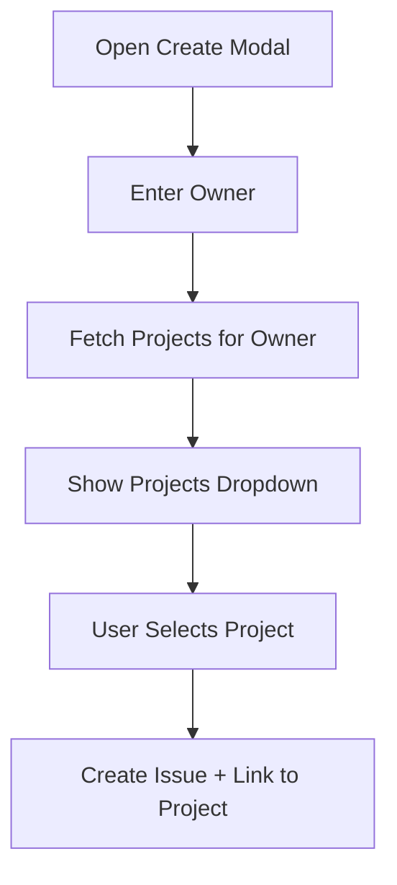
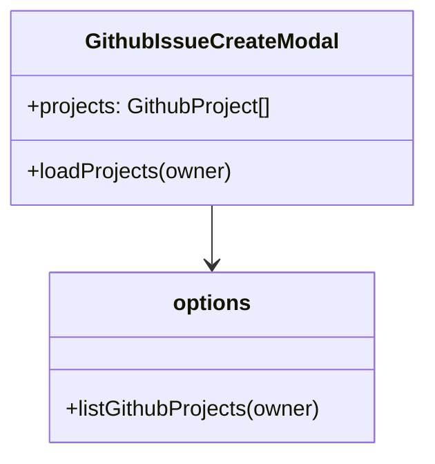

# Feature: GitHub Project Selection & Validation

## Brief Description
Allow users to select from a list of available GitHub Projects instead of manually typing a project number.

## User Story
As a developer, I want to select my project from a dropdown so I don't have to guess or look up the project number manually, ensuring error-free task linking.

## User Benefits
- Eliminates "Project Not Found" errors.
- Faster workflow (no need to switch to browser to find the number).
- Visual confirmation of the project name before creation.

## Acceptance Criteria
- [ ] Add an API endpoint to fetch GitHub Projects (v2) for a given owner.
- [ ] Update the Issue Creation modal to show a searchable dropdown/list of projects.
- [ ] Display the project title alongside its number for clarity.
- [ ] Handle both user-owned and organization-owned projects.

## Rough Complexity Estimate
Medium

## TDD Test Cases
### Unit Tests
- `listGithubProjects` helper correctly parses `gh project list` output.
- API returns empty list gracefully if no projects are found.

### Component Tests
- Project dropdown populates when an owner is selected.
- Selecting a project updates the internal `projectId` state.

### E2E Tests
- Open Create Modal, select owner, see list of projects, select one, and create issue.

## Mermaid: User Journey

## Mermaid: Module Structure

