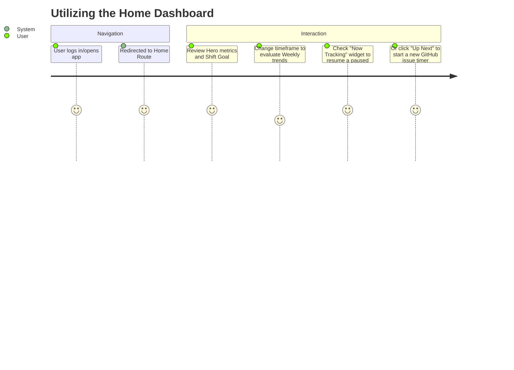
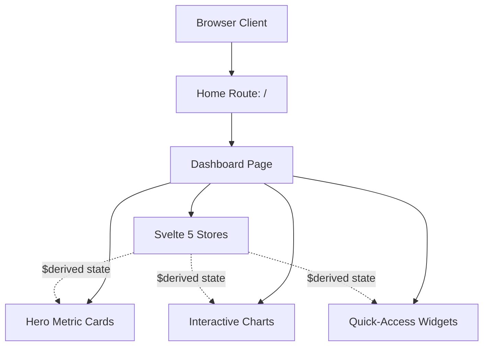
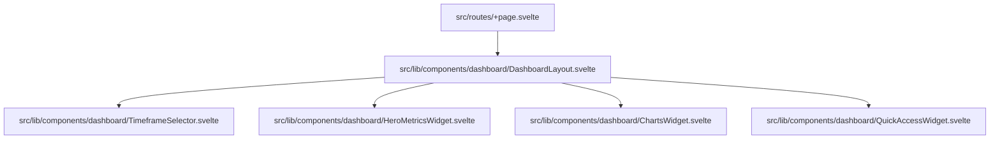

# Feature: Home Panel Dashboard (with Widget Specs)

## Description
An attractive, centralized home panel dashboard that provides an at-a-glance overview of all critical data and metrics in the system. The dashboard features a clean, dynamic, and modern UI leveraging Svelte 5 and Tailwind CSS, giving users immediate access to the information they need most without navigating through multiple pages. 

Unlike generic business dashboards, these components are specifically designed to interface with WorkTrack's core architecture, including time tracking, task management, and GitHub issue integration. All widgets consume Svelte 5 `$state` and `$derived` values from existing stores (`tracker`, `github`, `tasks`).

## User Story
As a user, I want to view a comprehensive home dashboard upon logging in or navigating to the home route, which includes an overview of my profile, interactive charts, and quick-access widgets for active timers and GitHub issues. I want to be able to filter these visual metrics by daily, weekly, monthly, and yearly timeframes so that I can immediately understand trends and jump right into my work.

## User Benefits
- **Time-saving:** Instantly see important information and access active timers without clicking through multiple tabs.
- **Improved Decision Making:** Centralized data overview highlights priorities and bottlenecks.
- **Enhanced User Experience:** A premium, visually appealing UI that feels dynamic and responsive.

## 1. "Hero" Metric Cards (At-a-Glance Data)
These cards sit at the top of the dashboard to provide immediate, high-level insights based on the selected timeframe.
*   **Time Tracked:** Aggregates the total `durationSeconds` from `WorkSession` objects.
*   **Shift Goal Progress:** A visual progress bar comparing "Time Tracked" against the user's configured shift goals.
*   **Active Timers Count:** A live counter tracking the number of `ActiveTimer` objects currently "Running".
*   **Pending GitHub Issues:** A dynamic metric showing the number of linked `GithubIssueRef` items requiring attention.

## 2. Interactive Charts & Visualizations
*   **Time Allocation (Doughnut/Pie Chart):** Breaks down total tracked time grouped by `client` or `project`.
*   **Activity Velocity (Bar Chart):** Displays hours logged sequentially over time to highlight productivity trends.
*   **Status Distribution (Stacked Bar/Radar):** Compares the ratio of tasks marked 'Pending', 'In Progress', 'On Hold', and 'Completed'.

## 3. Actionable Quick-Access Widgets
*   **"Now Tracking" (Active Timers):** Compact list of `ActiveTimer` objects with inline pause, resume, or complete buttons.
*   **"Up Next" (GitHub Integration):** Surfaces 3-5 prioritized GitHub issues, wired directly to `startTimerFromGithubIssue()`.
*   **Recent Work Sessions (Mini-Log):** A condensed `LogsPanel` displaying the 3-5 most recently completed entries.

## Acceptance Criteria
- [ ] Dashboard is accessible at the root route (`/` or `/dashboard`).
- [ ] 4 "Hero" metric cards render and reactively update based on Svelte store `$derived` values.
- [ ] Shift goal progress calculates correctly against the user's configured daily target.
- [ ] Time Allocation and Activity Velocity charts render and update when the timeframe toggle changes.
- [ ] "Now Tracking" widget displays active timers with functional, inline play/pause/stop buttons.
- [ ] "Up Next" widget surfaces GitHub issues and successfully triggers `startTimerFromGithubIssue()` on click.
- [ ] Responsive design stacks metric cards and charts seamlessly on mobile, tablet, and desktop using Tailwind CSS.
- [ ] Implemented as Svelte 5 components using Runes (`$state`, `$derived`, etc.).

## Rough Complexity Estimate
**Medium-High** (Due to the integration of interactive charts and direct multi-store state manipulation)

## TDD Test Cases
1. **Renders properly:** The dashboard component mounts and displays metric cards, charts, and quick-access widgets.
2. **State Reactivity:** Metric cards and charts update automatically when the underlying store data or timeframe `$state` changes.
3. **Active Timer Controls:** Clicking "Pause" or "Resume" on an item in the "Now Tracking" widget correctly invokes the store's update function.
4. **GitHub Issue Integration:** Clicking an issue in the "Up Next" widget successfully triggers the `startTimerFromGithubIssue()` function.
5. **Empty states:** Widgets display appropriate empty states (e.g., "No active timers") when no data is available.
6. **Responsiveness:** The layout adapts to smaller viewport sizes correctly, shifting from a grid to a stacked column.

## Diagrams

### User Journey

### System Placement

### Module Structure
