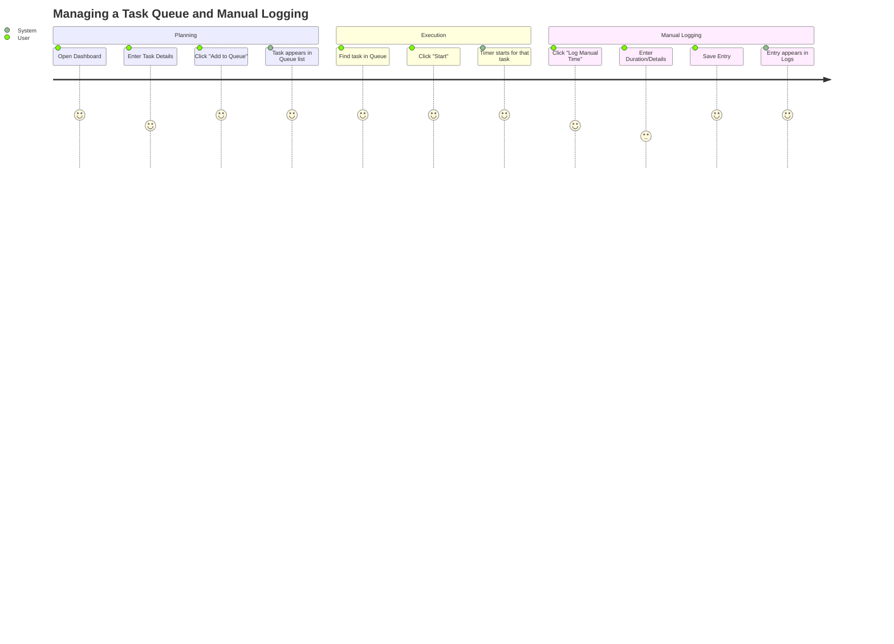
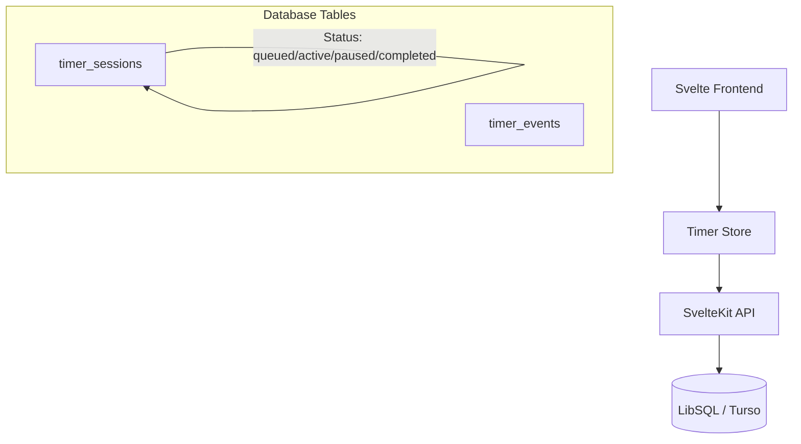
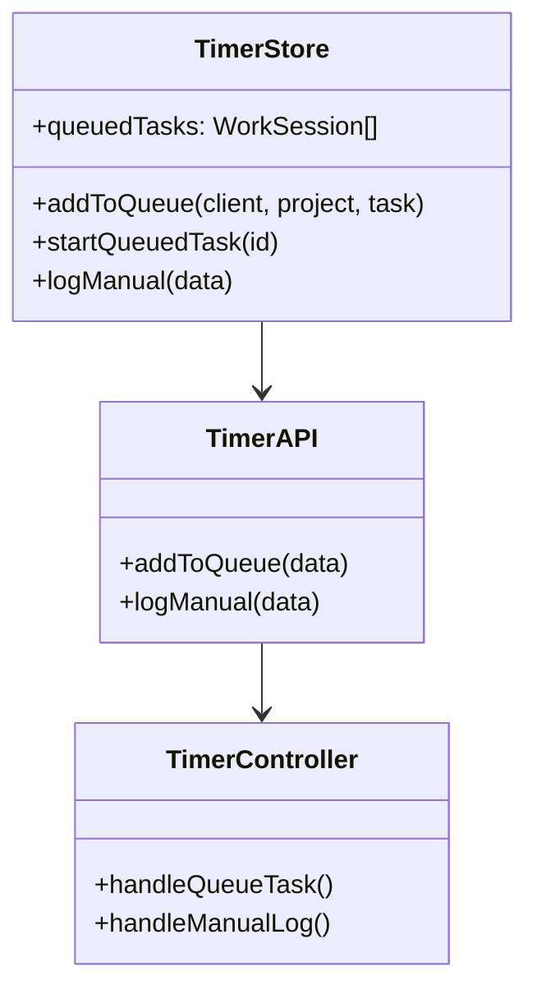

# Feature: Manual Timer and Task Queue

## Description
This feature allows users to manually log past work sessions and manage a persistent task queue within the application. Currently, the "Queued Tasks" section only displays paused timers. This enhancement will allow users to pre-populate a list of tasks they plan to work on and log time entries after the fact.

## User Story
As a user, I want to:
1. Add tasks to a "Planned" queue without starting a timer immediately.
2. Manually log work sessions (e.g., meetings or offline work) by specifying the duration or start/end times.
3. Have these tasks and entries persist in the database so I can access them from any device.

## User Benefits
- **Better Planning**: Organize your day by queuing up tasks in advance.
- **Accuracy**: Ensure all work is tracked, even if a live timer wasn't used.
- **Persistence**: Your "to-do" queue won't disappear if you refresh your browser.

## Acceptance Criteria
- [ ] UI provides an "Add to Queue" button next to "Start Timer".
- [ ] UI provides a "Manual Entry" modal/form for logging past work.
- [ ] Database schema updated (or `timer_sessions` status extended) to support 'queued' tasks.
- [ ] API endpoints created/updated to handle queued tasks and manual logs.
- [ ] Queued tasks can be started with a single click, transitioning them to 'active'.
- [ ] Manual logs are correctly reflected in Dashboard charts and Reports.

## Rough Complexity Estimate
Medium (Requires schema updates, API changes, and UI additions)

## TDD Test Cases
- `POST /api/timer/session` with `status: 'queued'` should create a session with 0 duration.
- `PATCH /api/timer/session/[id]` should transition a 'queued' task to 'active'.
- `POST /api/timer/manual` should create a 'completed' session with a user-defined duration and timestamp.
- `GET /api/timer/active` should not return 'queued' tasks.

## Diagrams

### User Journey

### System Placement

### Module Structure

