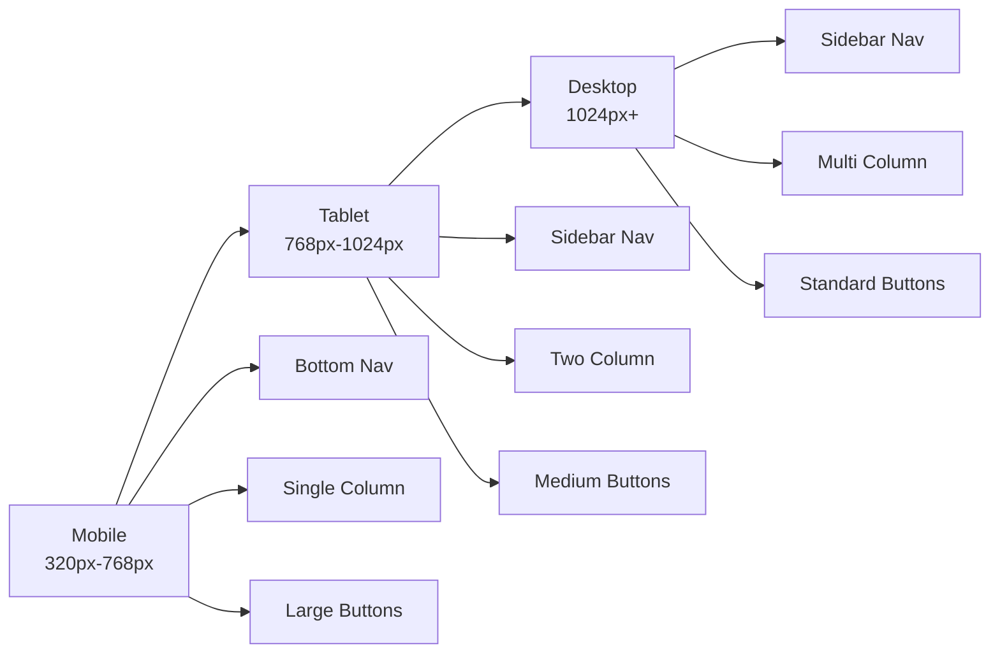
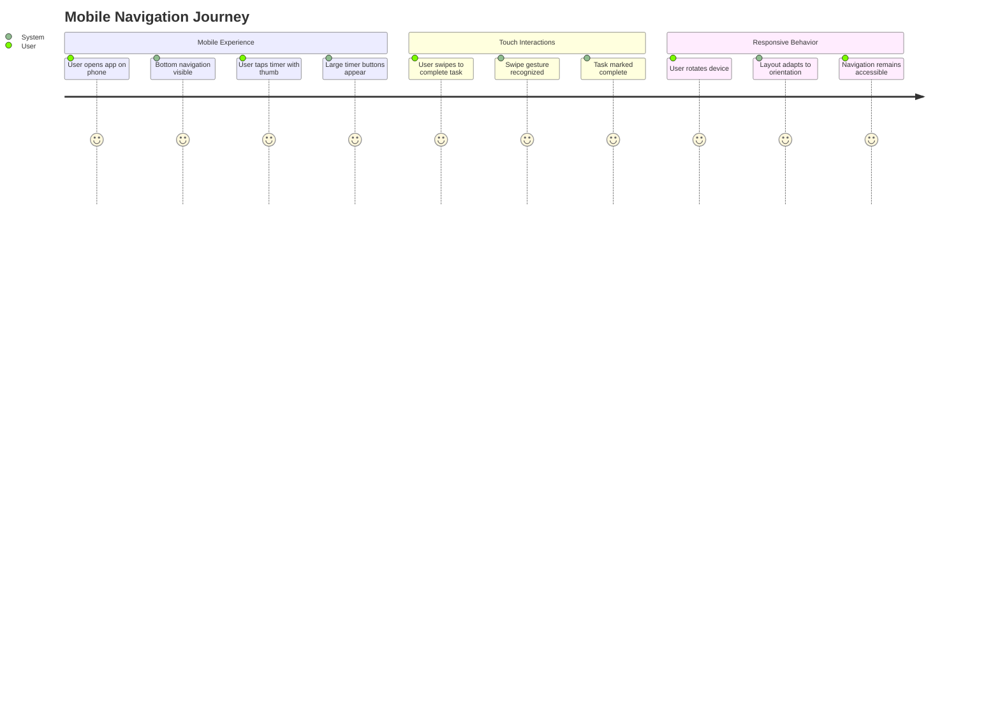
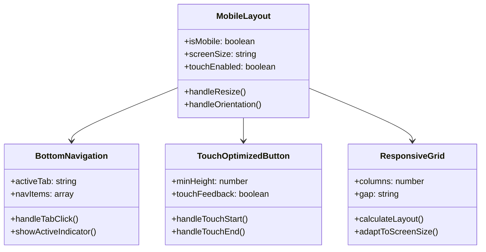

# Feature: Mobile Responsive UI

## Description
Enhance the mobile user experience with large buttons, bottom navigation, and responsive grid/list layouts optimized for touch interactions and mobile devices.

## User Story
As a mobile user, I want large, easy-to-tap buttons and intuitive navigation optimized for touch screens, so that I can efficiently use the time tracking app on my mobile device.

## User Benefits
- Improved mobile usability with larger touch targets
- Intuitive bottom navigation for thumb-friendly access
- Responsive layouts that work on all screen sizes
- Better accessibility for users with motor impairments
- Enhanced user experience on tablets and phones

## Acceptance Criteria
- [ ] Large touch-friendly buttons (minimum 44px tap targets)
- [ ] Bottom navigation bar for mobile devices
- [ ] Responsive grid layout that adapts to screen size
- [ ] List view optimized for mobile scrolling
- [ ] Touch-optimized form inputs and controls
- [ ] Swipe gestures for common actions
- [ ] Mobile-first responsive design approach
- [ ] Proper viewport and touch-action configurations

## Rough Complexity Estimate
Medium

## TDD Test Cases
1. **Touch Target Size**: Verify all interactive elements meet minimum touch target size
2. **Bottom Navigation**: Verify bottom navigation appears on mobile devices
3. **Responsive Layout**: Verify layout adapts correctly to different screen sizes
4. **Touch Gestures**: Verify swipe gestures work correctly on mobile
5. **Form Inputs**: Verify mobile-optimized keyboards and inputs

## Mermaid Diagrams

### Responsive Breakpoints

### Mobile Navigation Flow

### Component Structure

