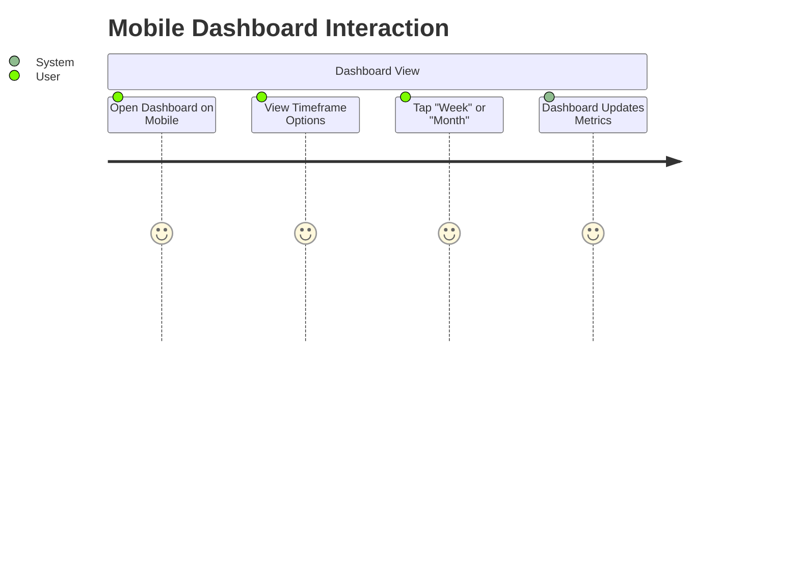
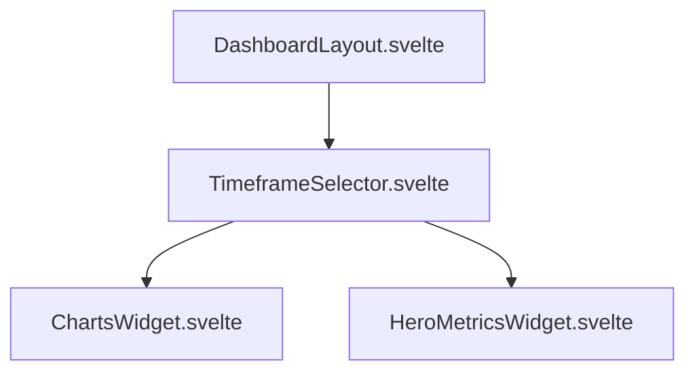
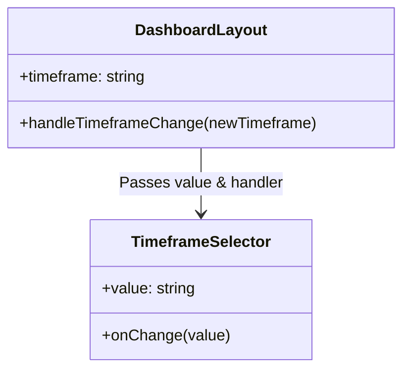

# Feature: Mobile Timeframe Selector Fix

## Description
This feature addresses layout and usability issues with the timeframe selector (daily, weekly, monthly, yearly) on the dashboard when viewed on mobile devices. The goal is to ensure the selector remains fully visible, accessible, and aesthetically pleasing on smaller screens without overflowing or squishing the interface.

## User Story
As a mobile user of WorkTrack,
I want the dashboard timeframe selector to fit neatly on my screen,
So that I can easily switch between daily, weekly, monthly, and yearly views without horizontal scrolling or distorted UI elements.

## User Benefits
- **Improved UX on Mobile**: Prevents UI breakage on smaller screens.
- **Accessibility**: Ensures touch targets (buttons) are adequately sized and reachable.
- **Consistency**: Maintains a polished, modern design language across all device sizes.

## Acceptance Criteria
- [ ] The timeframe selector (Day, Week, Month, Year) does not overflow the screen horizontally on devices as narrow as 320px.
- [ ] Buttons have adequate padding and touch targets for mobile users.
- [ ] The layout adapts gracefully (e.g., using horizontal scrolling with hidden scrollbars, or a grid/flex layout that wraps cleanly) while preserving the current desktop layout.
- [ ] Selected states remain clear and distinct on mobile.

## Rough Complexity Estimate
**Low** (Primarily involves updating Tailwind CSS classes for responsive design).

## TDD Test Cases
1. **Responsiveness**: Verify that the component uses `flex-wrap` or `overflow-x-auto` to handle narrow viewports.
2. **Interactive States**: Verify that selecting a different timeframe updates the active state and calls the `onChange` handler.

## Mermaid Diagrams

### User Journey

### System Placement

### Module Structure

