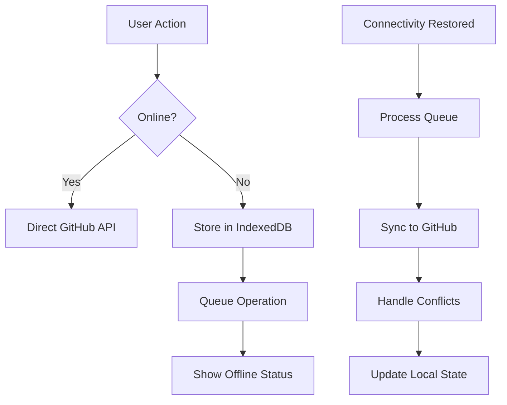
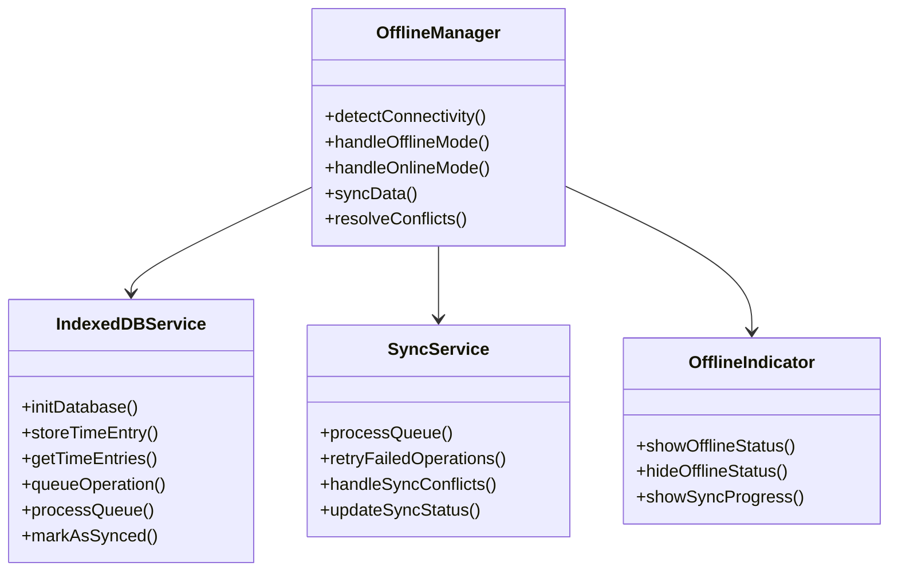

# Feature: Offline Support with IndexedDB

## Description
Implement comprehensive offline support using IndexedDB to store time entries locally and queue GitHub writes when the application is offline. This ensures users can continue tracking time even without internet connectivity.

## User Story
As a user, I want to track time and manage tasks even when I'm offline, so that my work continues uninterrupted and my data syncs automatically when I regain internet connectivity.

## User Benefits
- Uninterrupted time tracking in any connectivity situation
- No data loss during internet outages
- Automatic data synchronization when back online
- Improved app performance with local data storage
- Reliable operation in poor network conditions

## Acceptance Criteria
- [ ] IndexedDB database schema for time entries and tasks
- [ ] Offline detection and status indicator
- [ ] Local storage of all time entries and task data
- [ ] GitHub write operations queued when offline
- [ ] Automatic sync when connectivity restored
- [ ] Conflict resolution for sync conflicts
- [ ] Offline mode UI indicators and messaging
- [ ] Background sync API integration (optional)

## Rough Complexity Estimate
High

## TDD Test Cases
1. **Offline Storage**: Verify data is stored in IndexedDB when offline
2. **Queue Management**: Verify GitHub operations are properly queued
3. **Sync Process**: Verify queued operations sync when online
4. **Conflict Resolution**: Verify handling of sync conflicts
5. **Offline Detection**: Verify proper offline/online status detection
6. **Data Integrity**: Verify no data loss during offline/online transitions

## Mermaid Diagrams

### Offline Data Flow


### Database Schema
```mermaid
erDiagram
    TimeEntries {
        string id PK
        string client
        string project
        string task
        number startTime
        number endTime
        number duration
        string status
        string githubIssueId
        boolean synced
        timestamp createdAt
        timestamp updatedAt
    }
    
    Tasks {
        string id PK
        string client
        string project
        string task
        string assignee
        string status
        boolean synced
        timestamp createdAt
        timestamp updatedAt
    }
    
    SyncQueue {
        string id PK
        string operation
        object data
        string status
        number retryCount
        timestamp createdAt
        timestamp nextRetryAt
    }
    
    TimeEntries ||--o{ SyncQueue
    Tasks ||--o{ SyncQueue
```

### Module Structure

