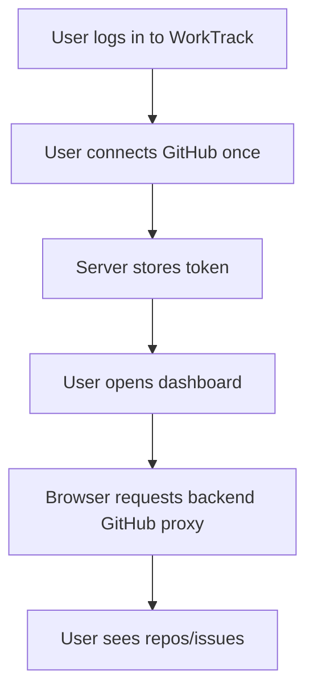
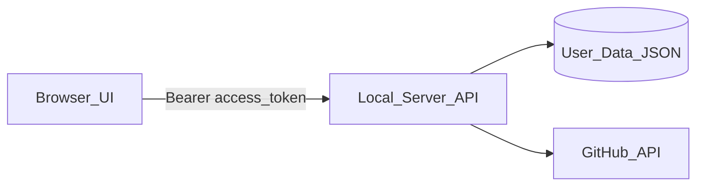
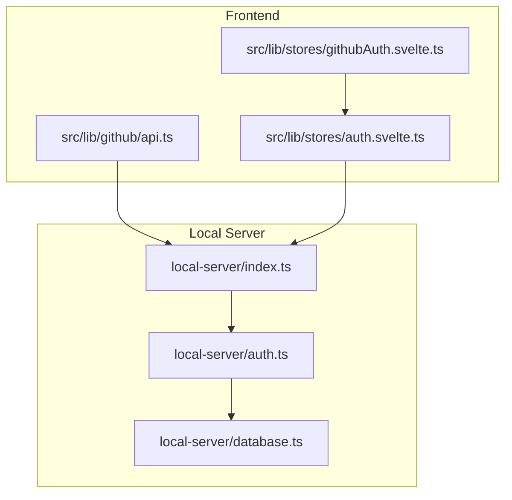

# Server-Side GitHub Token Proxy

## Brief description
Move GitHub token handling to backend-only storage and route all GitHub data access through authenticated server proxy endpoints.

## User Story
As a WorkTrack user, I want my GitHub token to be handled only by the server so that my browser never stores it and my account is safer across devices.

## User benefits
- Reduces token exposure in browser storage and dev tools.
- Centralizes GitHub auth behavior across devices.
- Keeps existing UI behavior while improving security boundaries.

## Acceptance criteria
- Auth responses do not include `github_token` in browser-visible payloads.
- Browser GitHub data calls target backend endpoints instead of direct `https://api.github.com` requests.
- Backend proxy endpoints fetch GitHub profile/org/repos/issues using the authenticated user’s server-side token.
- Disconnecting GitHub clears server token and prevents further proxy access.

## Rough complexity estimate
Medium

## TDD test cases
1. `GET /api/auth/me` returns `github_connected` but not `github_token`.
2. `GET /api/github/user` returns `409` when user has no connected GitHub token.
3. `GET /api/github/repos` proxies GitHub response for a connected user.
4. Client `getUserProfile/getUserRepos/getUserOrgs/getRepoIssues` use backend proxy paths and do not require client token.
5. Existing logout/disconnect flow still results in disconnected GitHub state.

## Mermaid diagrams

### User journey

### System placement

### Module structure

