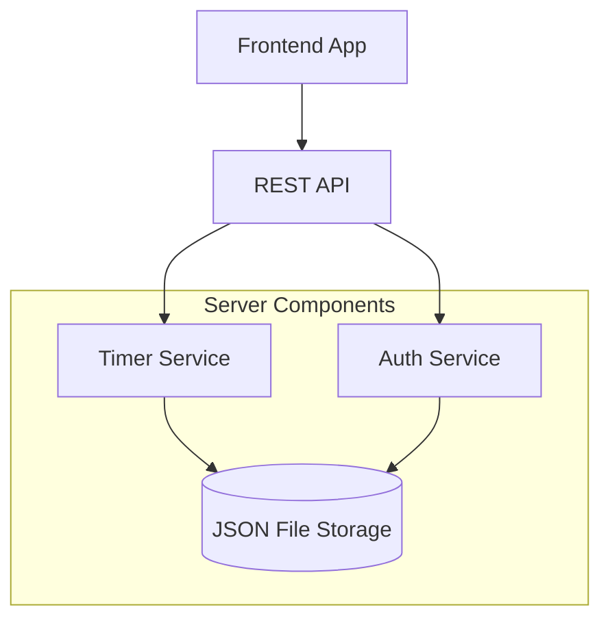
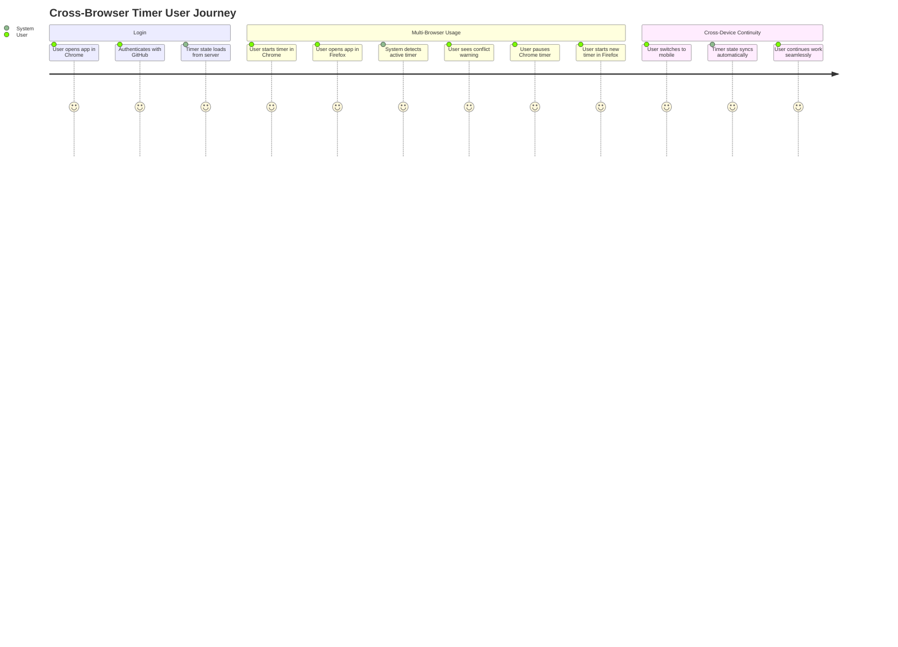
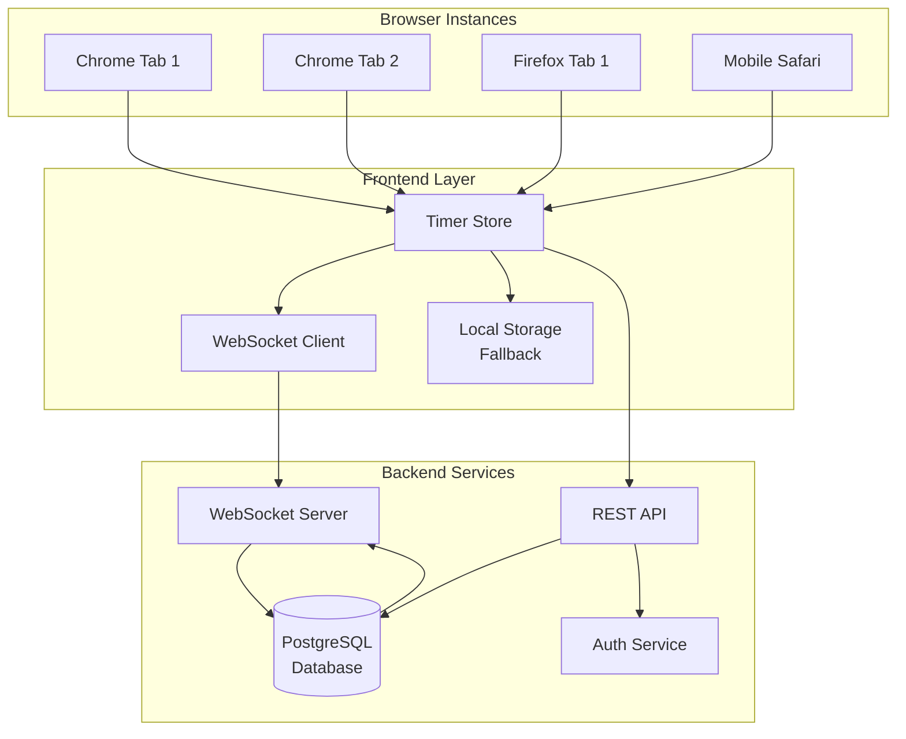

# Server-Side Timer State Management

## Overview
Implement server-side timer state management to enable cross-browser and cross-device timer synchronization, ensuring only one active timer per user at any time.

## Implementation Status
✅ **Completed** - Server-side timer state management implemented and tested

### What Was Built
- **Database Layer**: JSON file-based storage system (database.ts)
- **Authentication Service**: User management with token-based auth (auth.ts)  
- **Timer Service**: Complete timer CRUD operations with conflict detection (timer.ts)
- **REST API**: Full timer management endpoints in Hono server
- **Conflict Prevention**: Server-side enforcement of single active timer per user
- **Data Persistence**: Timer sessions and events stored durably

### API Endpoints Implemented
```
POST   /api/auth/login          - User authentication
GET    /api/auth/me             - Get current user
POST   /api/auth/logout         - User logout
GET    /api/timer/active        - Get user's active timer
POST   /api/timer/start         - Start new timer
POST   /api/timer/:id/pause     - Pause timer
POST   /api/timer/:id/resume    - Resume timer
POST   /api/timer/:id/complete  - Complete timer
DELETE /api/timer/:id           - Discard timer
GET    /api/timer/sessions      - Get timer history
GET    /api/timer/:id/events    - Get timer events
```

### Testing Results
✅ Authentication: User creation and token generation working  
✅ Timer Creation: New timers created with proper validation  
✅ Conflict Detection: Prevents multiple active timers per user  
✅ Timer Completion: Properly calculates duration and updates status  
✅ Sequential Operations: Can start new timer after completing previous  

### Technical Architecture


### Data Models
**User**: `{id, github_id, username, email, avatar_url, timestamps}`  
**TimerSession**: `{id, user_id, client, project, task, status, start_time, end_time, duration_seconds, device_info, timestamps}`  
**TimerEvent**: `{id, session_id, event_type, timestamp, device_info, metadata}`

### Key Features
- **Cross-browser enforcement**: Server prevents multiple active timers regardless of browser/device
- **Conflict detection**: Clear error messages when timer conflicts occur
- **Audit trail**: All timer events logged for debugging and analytics
- **Device tracking**: Device info stored with each timer operation
- **Duration calculation**: Automatic calculation of timer duration on pause/complete

## User Story
As a user working across multiple browsers/devices, I want my timer state to be synchronized so I don't accidentally start multiple timers simultaneously, and I can seamlessly continue work across different devices.

## User Benefits
- **Cross-browser synchronization**: Timer state persists and conflicts are prevented across Chrome, Firefox, Safari, etc.
- **Cross-device continuity**: Start work on desktop, continue on mobile
- **Conflict prevention**: System prevents multiple simultaneous timers
- **Real-time updates**: Changes reflect immediately across all open instances
- **Data persistence**: Timer sessions survive browser crashes or device restarts

## Acceptance Criteria
- [x] User authentication required for timer operations
- [x] Only one active timer per user across all devices/browsers
- [ ] Real-time synchronization between browser instances
- [x] Timer state persists server-side with localStorage fallback
- [x] Conflict detection with clear user feedback
- [ ] Graceful offline mode with localStorage
- [ ] Timer recovery when reconnecting after network issues

## Rough Complexity Estimate
**High** - Requires backend infrastructure, authentication, real-time sync, and significant frontend refactoring

## TDD Test Cases

### Authentication & User Management
- Should require authentication for timer operations
- Should identify users uniquely across devices
- Should handle anonymous users gracefully
- Should validate user permissions for timer access

### Timer State Management
- Should create timer on server when started locally
- Should prevent multiple active timers per user
- Should sync timer state across browser tabs
- Should sync timer state across different browsers
- Should handle timer conflicts with clear error messages
- Should recover timer state on app reload
- Should persist timer state server-side

### Real-time Synchronization
- Should broadcast timer changes to all user instances
- Should handle network disconnections gracefully
- Should sync paused/completed timers across devices
- Should prevent race conditions in timer operations

### Offline Mode
- Should fallback to localStorage when server unavailable
- Should sync local changes when connection restored
- Should handle conflicts between local and server state

## Technical Implementation

### Database Schema
```sql
-- Users table (GitHub OAuth integration)
CREATE TABLE users (
  id SERIAL PRIMARY KEY,
  github_id VARCHAR(255) UNIQUE NOT NULL,
  username VARCHAR(255) NOT NULL,
  email VARCHAR(255),
  avatar_url VARCHAR(500),
  created_at TIMESTAMP DEFAULT CURRENT_TIMESTAMP,
  updated_at TIMESTAMP DEFAULT CURRENT_TIMESTAMP
);

-- Timer sessions table
CREATE TABLE timer_sessions (
  id SERIAL PRIMARY KEY,
  user_id INTEGER REFERENCES users(id) ON DELETE CASCADE,
  client VARCHAR(255) NOT NULL,
  project VARCHAR(255) NOT NULL,
  task VARCHAR(255) NOT NULL,
  status VARCHAR(50) NOT NULL DEFAULT 'active', -- active, paused, completed
  start_time TIMESTAMP NOT NULL,
  end_time TIMESTAMP NULL,
  duration_seconds INTEGER DEFAULT 0,
  device_info JSONB, -- browser, OS, IP info
  created_at TIMESTAMP DEFAULT CURRENT_TIMESTAMP,
  updated_at TIMESTAMP DEFAULT CURRENT_TIMESTAMP,
  UNIQUE(user_id, status) WHERE status = 'active' -- Only one active timer per user
);

-- Timer events for audit trail
CREATE TABLE timer_events (
  id SERIAL PRIMARY KEY,
  session_id INTEGER REFERENCES timer_sessions(id) ON DELETE CASCADE,
  event_type VARCHAR(50) NOT NULL, -- start, pause, resume, complete, discard
  timestamp TIMESTAMP DEFAULT CURRENT_TIMESTAMP,
  device_info JSONB,
  metadata JSONB -- additional event data
);
```

### API Endpoints

#### Authentication
- `POST /api/auth/login` - GitHub OAuth login
- `GET /api/auth/me` - Get current user info
- `POST /api/auth/logout` - Logout

#### Timer Management
- `GET /api/timer/active` - Get user's active timer
- `POST /api/timer/start` - Start new timer
- `POST /api/timer/{id}/pause` - Pause timer
- `POST /api/timer/{id}/resume` - Resume timer
- `POST /api/timer/{id}/complete` - Complete timer
- `DELETE /api/timer/{id}` - Discard timer
- `GET /api/timer/sessions` - Get timer history

#### Real-time Sync
- WebSocket endpoint: `/ws/timer` - Real-time timer updates
- Server-Sent Events fallback for older browsers

### Frontend Architecture

#### State Management
```typescript
interface ServerTimerState {
  activeTimer: TimerSession | null;
  isOnline: boolean;
  lastSync: Date | null;
  conflicts: TimerConflict[];
}

interface TimerConflict {
  id: string;
  message: string;
  conflictingDevice: DeviceInfo;
  timestamp: Date;
}
```

#### Synchronization Strategy
1. **Optimistic Updates**: Apply changes locally first, then sync to server
2. **Conflict Resolution**: Server wins on conflicts, with user notification
3. **Offline Queue**: Queue operations when offline, sync when reconnected
4. **Heartbeat**: Periodic sync to detect external changes

### Real-time Implementation

#### WebSocket Protocol
```typescript
// Client -> Server messages
interface TimerMessage {
  type: 'start' | 'pause' | 'resume' | 'complete' | 'discard';
  payload: TimerPayload;
  clientId: string; // Unique per browser tab
}

// Server -> Client messages
interface SyncMessage {
  type: 'sync' | 'conflict' | 'error';
  payload: any;
  timestamp: Date;
}
```

### Security Considerations
- JWT tokens for API authentication
- Rate limiting on timer operations
- Device fingerprinting for conflict detection
- Audit trail for timer events
- CORS configuration for cross-origin requests

## Mermaid Diagrams

### User Journey


### System Architecture


### Module Structure
```mermaid
graph TD
    subgraph "Frontend Modules"
        TM[TimerManager.svelte]
        TS[TimerStore.ts]
        WS[WebSocketService.ts]
        CS[ConflictService.ts]
        OS[OfflineService.ts]
    end

    subgraph "Backend Modules"
        TE[TimerEndpoints.ts]
        TM_S[TimerManager.ts]
        WS_S[WebSocketService.ts]
        DB[DatabaseService.ts]
        Auth_S[AuthService.ts]
    end

    subgraph "Shared Types"
        TT[TimerTypes.ts]
        AT[AuthTypes.ts]
        ST[SyncTypes.ts]
    end

    TM --> TS
    TS --> WS
    TS --> CS
    TS --> OS

    TE --> TM_S
    TM_S --> WS_S
    TM_S --> DB
    TE --> Auth_S

    TS --> TT
    TM_S --> TT
    WS --> ST
    WS_S --> ST
    Auth_S --> AT
    TE --> AT
```</content>
<parameter name="filePath">h:/Seffin/Benjamin/Sample/.local/features/server-side-timer-state-management.md