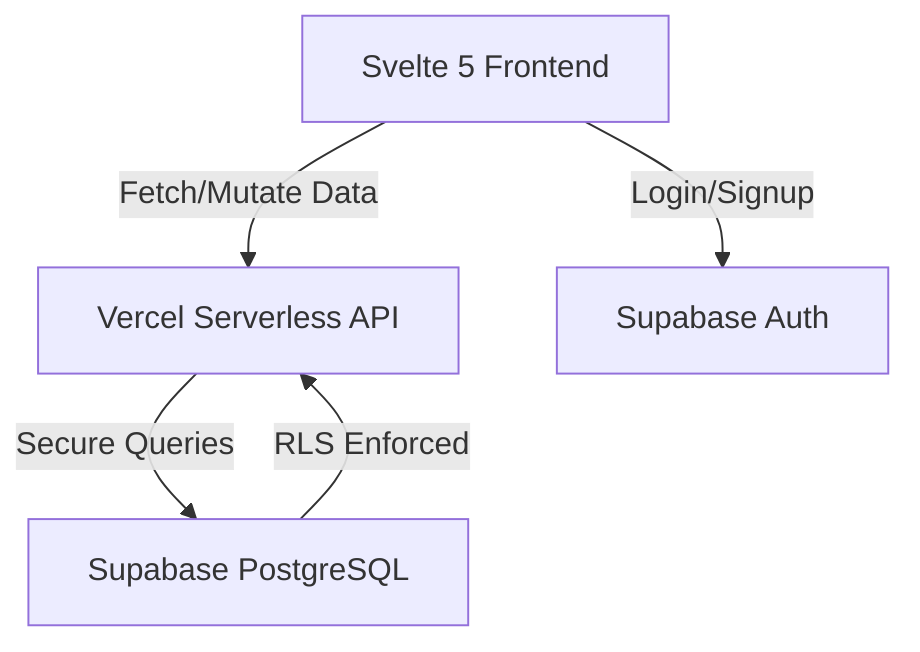

# Feature: Migration to Supabase and Vercel

## Description
Refactor the WorkTrack application from a local-first architecture (Hono + JSON) to a production-ready cloud architecture using Supabase (Auth + PostgreSQL) and Vercel (SvelteKit serverless API routes). 

## User Story
As a WorkTrack user,
I want my data securely synced to the cloud,
So that I can access my timers and settings from any device without data loss, and the platform can scale securely.

## User Benefits
- **True Cross-Device Sync**: Data is stored in a robust PostgreSQL database in the cloud.
- **Enterprise Security**: Row Level Security (RLS) ensures absolute data isolation between users.
- **Reliability**: Vercel serverless functions replace the brittle local Node.js server.

## Acceptance Criteria
- [ ] `local-server/` directory and `worktrack-data.json` are completely removed.
- [ ] Supabase Auth handles email/password registration, login, and session persistence.
- [ ] PostgreSQL tables (`profiles`, `timer_sessions`, `timer_events`) are created via SQL migrations.
- [ ] Row Level Security (RLS) is strictly enforced on all tables (`auth.uid() = user_id`).
- [ ] SvelteKit API routes (`src/routes/api/*`) securely handle timer logic and database interactions.
- [ ] Frontend stores (`auth.svelte.ts`, `timer.svelte.ts`) are refactored to use Supabase/new API routes.

## Rough Complexity Estimate
**High** (Involves a complete backend replacement, database design, auth swap, and extensive frontend refactoring).

---

## 🛠️ Implementation Plan

### Phase 1: Setup & Initialization
1. Install dependencies: `bun add @supabase/supabase-js`.
2. Configure environment variables in `.env` (`PUBLIC_SUPABASE_URL`, `PUBLIC_SUPABASE_ANON_KEY`).
3. Create a Supabase client utility in `src/lib/supabaseClient.ts`.

### Phase 2: Database Schema & RLS Execution
1. Create a SQL migration file to set up the database.
2. **Tables**:
   - `profiles`: Link to `auth.users`, store `username`, `github_token`, `github_repo`.
   - `timer_sessions`: Track tasks, linked to `profiles` via `user_id` (UUID).
   - `timer_events`: Track granular timer actions, linked to `timer_sessions`.
3. **RLS Policies**: Enforce strict isolation.
   - Example: `CREATE POLICY "Users can manage their own sessions" ON timer_sessions FOR ALL USING (auth.uid() = user_id);`

### Phase 3: Auth Refactoring
1. Rewrite `src/lib/stores/auth.svelte.ts` to consume Supabase Auth directly.
2. Implement `supabase.auth.signUp()`, `signInWithPassword()`, and `signOut()`.
3. Setup an auth state listener (`onAuthStateChange`) to automatically sync the Svelte store.
4. Setup an automatic trigger in PostgreSQL to create a `profile` row when a new user signs up.

### Phase 4: Backend API Migration (Vercel Serverless)
1. Move timer logic from `local-server/timer.ts` into SvelteKit API routes (e.g., `src/routes/api/timer/start/+server.ts`).
2. API routes will authenticate the request via the Supabase session token, ensuring actions are authorized.
3. Replace the local JSON reads/writes with Supabase PostgreSQL queries (using the Supabase server client).

### Phase 5: Frontend Integration & Store Updates
1. Refactor `src/lib/stores/timer.svelte.ts` to call the new SvelteKit API endpoints (or directly use the Supabase client, depending on security needs).
2. Ensure components like `TimerPanel` and `DashboardLayout` react properly to the new asynchronous cloud calls.

### Phase 6: Legacy Cleanup & Testing
1. **Delete** the entire `local-server/` directory.
2. Remove `bun run dev:all` from `package.json` and simplify to standard `vite dev`.
3. Conduct end-to-end testing of the auth flow and timer logic.
4. Deploy to Vercel and verify functionality in production.

## Mermaid Diagrams

### System Architecture

