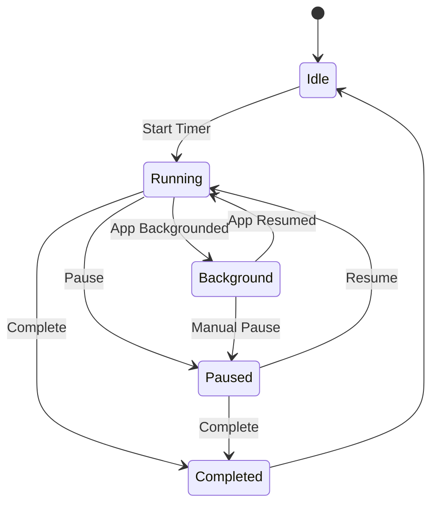
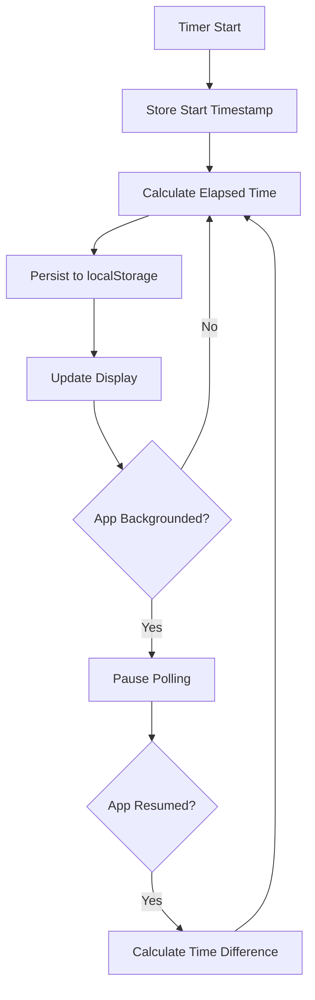
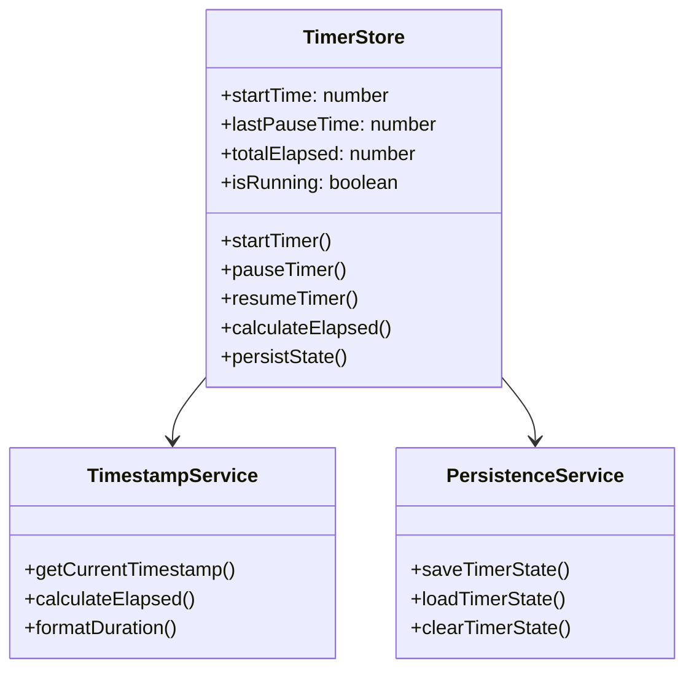

# Feature: Timer Persistence with Timestamp

## Description
Refactor timer persistence to use localStorage + timestamp approach instead of setInterval. This ensures timers continue accurately even when the app is in the background or the browser kills background processes.

## User Story
As a user, I want my timer to continue tracking time accurately even when I switch apps or the browser goes into background, so that my time tracking remains reliable and I don't lose any tracked time.

## User Benefits
- Accurate time tracking across app backgrounding
- No lost time when browser kills background processes
- Better battery performance (no constant setInterval)
- Reliable timer restoration on app resume
- Consistent time tracking across device reboots

## Acceptance Criteria
- [ ] Timer uses timestamp-based calculation instead of setInterval counting
- [ ] Timer persists session start time and elapsed time to localStorage
- [ ] Timer calculates elapsed time based on timestamps on resume
- [ ] Timer handles app backgrounding/resume gracefully
- [ ] Timer survives browser tab closure and reopening
- [ ] Timer remains accurate across device time changes
- [ ] Performance improvements with reduced CPU usage

## Rough Complexity Estimate
Medium

## TDD Test Cases
1. **Timestamp Calculation**: Verify timer calculates elapsed time correctly from timestamps
2. **Background Resume**: Verify timer accuracy after app backgrounding
3. **Tab Closure**: Verify timer persists and restores correctly after tab closure
4. **Time Accuracy**: Verify timer remains accurate across different time scenarios
5. **Performance**: Verify reduced CPU usage compared to setInterval approach

## Mermaid Diagrams

### Timer Lifecycle

### Data Flow

### Module Structure

