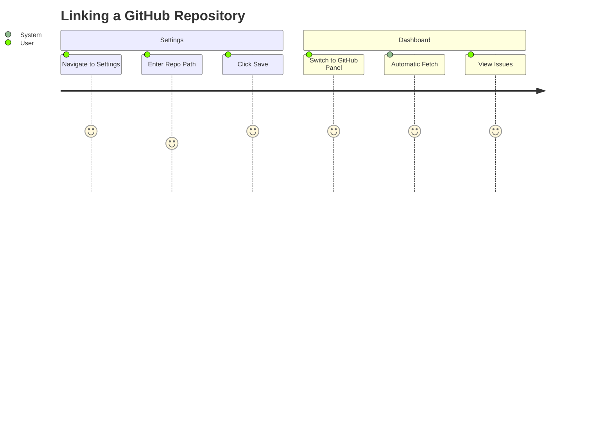
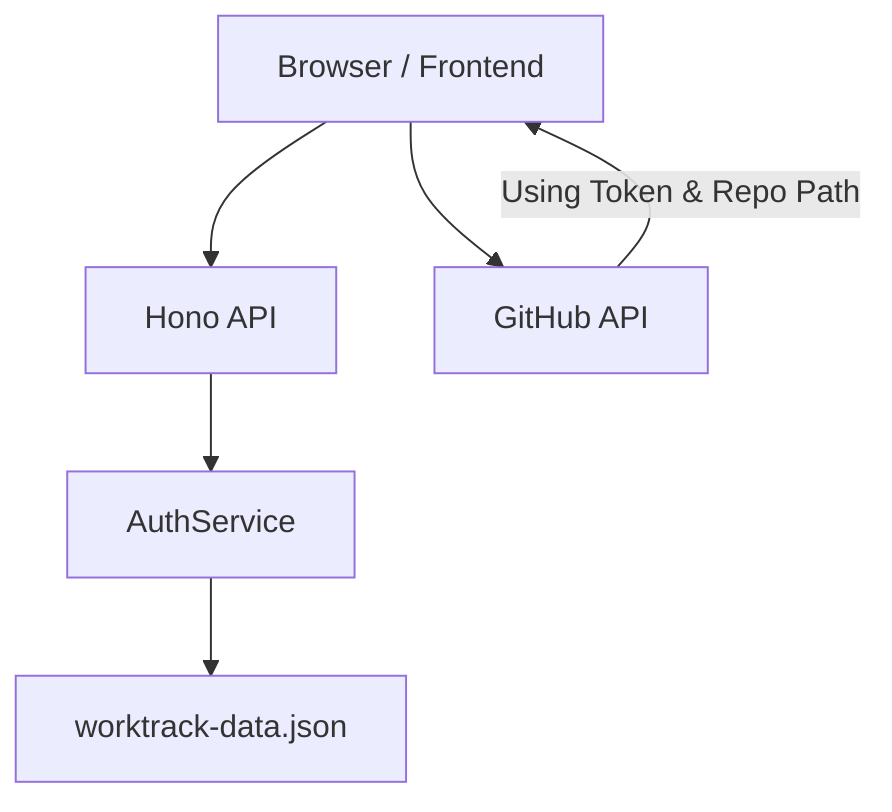
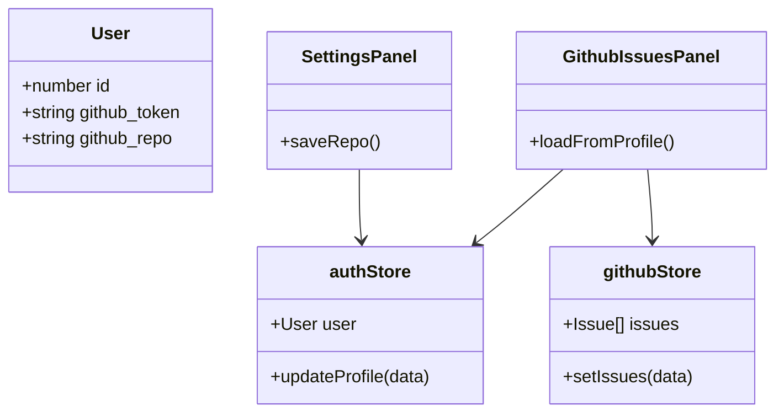

# Feature: User-Specific GitHub Repository Linking

## Description
This feature allows each WorkTrack user to specify and persist a default GitHub repository in their profile. The application will use this setting to automatically load issues when the user logs in, providing a personalized and isolated experience for multi-user environments.

## User Story
As a developer using WorkTrack,
I want to link my account to a specific GitHub repository,
So that I don't have to manually select the owner and repo every time I log in.

## User Benefits
- **Efficiency**: Reduces manual steps during startup by auto-loading the relevant workspace.
- **Data Isolation**: In multi-user environments, different users can track different projects without interference.
- **Persistence**: Preferences are saved to the backend and synchronized across devices/sessions.

## Acceptance Criteria
- [ ] Users can enter a repository path (e.g., `owner/repo`) in the Settings panel.
- [ ] The repository preference is saved to the backend `worktrack-data.json` file.
- [ ] Upon login or page refresh, the GitHub Tracking panel automatically populates the owner/repo fields from the user's profile.
- [ ] Issues are automatically fetched if a default repository is set.
- [ ] Settings are validated (must follow `owner/repo` format).

## Rough Complexity Estimate
**Medium** (Requires changes across backend storage, API, auth stores, and UI components).

## TDD Test Cases
1. **Store Logic**: `authStore` should correctly hold and update the `github_repo` field.
2. **Persistence**: Verify that calling `updateProfile` successfully updates the `worktrack-data.json` file.
3. **Auto-Initialization**: `GithubIssuesPanel` should split the `github_repo` string into `owner` and `repo` states on mount.

## Mermaid Diagrams

### User Journey

### System Placement

### Module Structure

