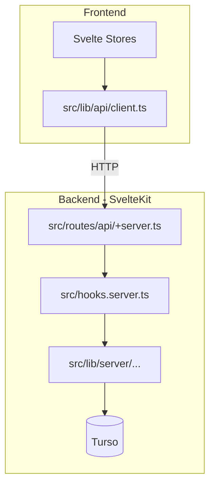

# Feature Proposal: Vercel & Turso Deployment Migration

## Description
Migrate the split local-server backend into native SvelteKit API routes to enable seamless deployment to Vercel's serverless environment, and configure the application to connect to a cloud Turso database securely.

## User Story
As a developer, I want to deploy the application to Vercel and connect it to a Turso database so that the application is accessible via the cloud without running a separate local Node.js server.

## User Benefits
- **Zero-Config Deployment**: The app can be deployed directly to Vercel without configuring separate backend infrastructure.
- **Improved Performance**: Serverless functions run natively within Vercel's edge/node network.
- **Reliable Data**: Switching to a cloud Turso DB prevents ephemeral storage loss in serverless environments.

## Acceptance Criteria
- [ ] Fork the repository (`thebenVar/scrummer`) to the user's personal GitHub account.
- [ ] Move `local-server/auth.ts`, `timer.ts`, and `database-turso.ts` to `src/lib/server/`.
- [ ] Refactor all `local-server/index.ts` Hono routes into SvelteKit `src/routes/api/.../+server.ts` endpoints.
- [ ] Migrate `authMiddleware` logic to `src/hooks.server.ts`.
- [ ] Update `src/lib/api/client.ts` to use relative paths instead of `localhost:3001`.
- [ ] Replace `gh` CLI commands in API routes with standard GitHub REST API fetch calls using OAuth tokens.
- [ ] Update `turso.ts` to enforce `TURSO_DATABASE_URL` in production (no fallback to local file in Vercel).
- [ ] All tests pass in the new architecture.

## Rough Complexity Estimate
**High**. This involves creating a fork, significant refactoring of the backend layer, modifying API routes, establishing a new middleware system in SvelteKit, and removing local environment dependencies (like the GitHub CLI).

## TDD Test Cases
1. `auth.server.spec.ts`: Verify `hooks.server.ts` correctly authenticates API requests using Bearer tokens.
2. `turso.spec.ts`: Verify the app throws a configuration error if initialized in production without environment variables.
3. `api-timer.spec.ts`: Test the new SvelteKit `+server.ts` timer endpoints locally before deploying.

## Architecture & System Placement

```mermaid
graph TD
    Client[Browser] -->|Relative /api Calls| Vercel[Vercel Serverless (SvelteKit)]
    Vercel -->|Database Calls| Turso[(Turso Cloud DB)]
    Vercel -->|REST API calls| GitHub[GitHub API]
```

## Module Structure


