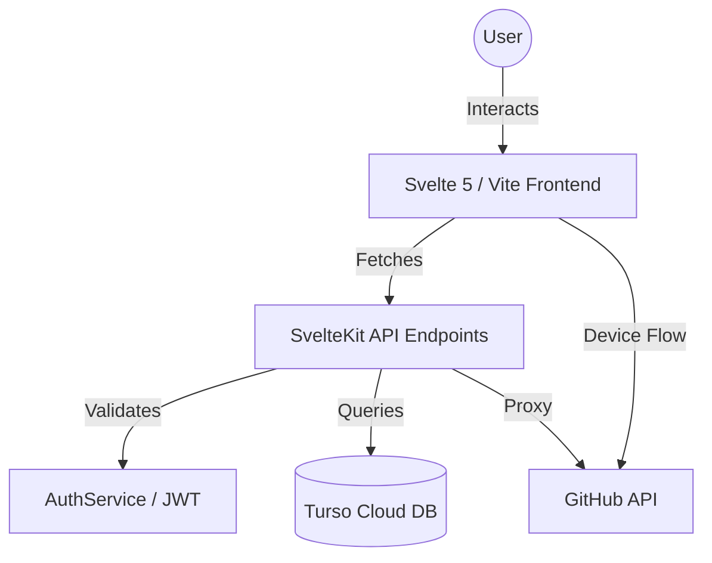
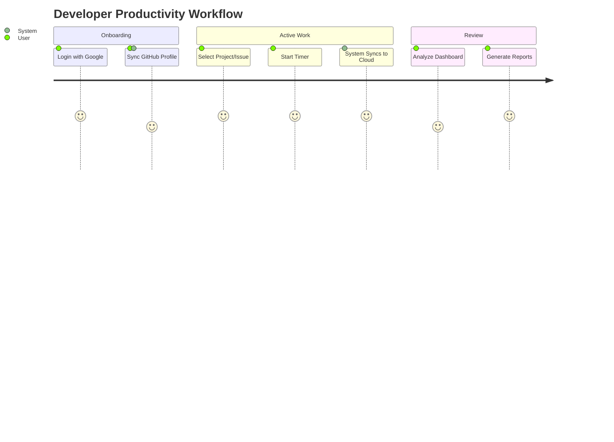

# Scrummer - Premium Time Management & GitHub Integration

Scrummer is a modern, high-performance time tracking application designed for developers. It features seamless GitHub integration, real-time sync with Turso cloud database, and a sleek Svelte 5 interface.

## 🏗️ System Architecture



## 🛠️ Technology Stack

| Layer | Technology |
|-------|------------|
| **Frontend** | Svelte 5 (Runes), Tailwind CSS |
| **Runtime** | Bun |
| **Backend** | SvelteKit (Serverless) |
| **Database** | Turso (SQLite via LibSQL) |
| **Deployment** | Vercel |
| **Authentication** | JWT + Google OAuth + GitHub Device Flow |

## 🚀 Key Features

### 1. Unified Time Tracking
*   **Timer Sessions**: Start, pause, and complete tasks with sub-second precision.
*   **Contextual Metadata**: Automatically captures browser and platform info for every session.
*   **Real-time Persistence**: Every event is sanitized and synced to Turso instantly.

### 2. GitHub Integration
*   **Issue Tracking**: Link timer sessions directly to GitHub issues.
*   **Device Flow**: Secure GitHub authentication without exposing credentials.
*   **API Proxying**: Clean, server-side communication with GitHub for repository and issue management.

### 3. Cloud-Native Stability
*   **Idempotent Migrations**: Automatic database schema updates on server startup.
*   **Driver Abstraction**: Uses universal `@libsql/client` to support Edge and Serverless runtimes.
*   **Strict Validation**: Enforced environment variable checks to prevent deployment failures.

## 📈 User Journey



## ⚙️ Local Development Setup

1.  **Install Dependencies**:
    ```bash
    bun install
    ```
2.  **Environment Configuration**:
    Create a `.env` file with your Turso and GitHub credentials:
    ```env
    TURSO_DATABASE_URL=libsql://your-db.turso.io
    TURSO_AUTH_TOKEN=your-token
    JWT_SECRET=your-random-string
    ```
3.  **Run Development Server**:
    ```bash
    bun run dev
    ```

## 🌐 Deployment

The project is optimized for **Vercel**. When deploying:
1.  Connect your GitHub repository.
2.  Configure the `TURSO_DATABASE_URL` and `TURSO_AUTH_TOKEN` in the Vercel Dashboard.
3.  Vercel will automatically use `@sveltejs/adapter-auto` to build the application as a set of high-performance serverless functions.
