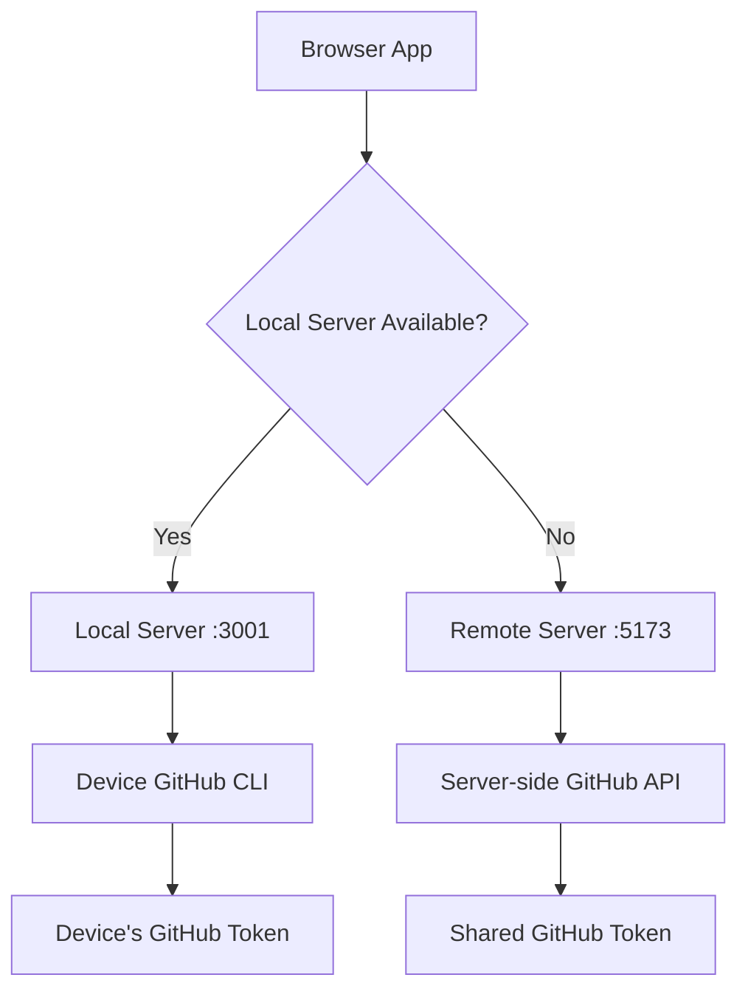

# Local Server Per-Device Architecture

## Overview
Each device runs its own local server that communicates with the device's GitHub CLI, enabling true per-device authentication and repository access.

## Architecture Components

### 1. Local Server (`local-server/`)
- **Purpose**: Communicates with device's GitHub CLI
- **Technology**: Node.js/Bun server with child process execution
- **Endpoints**:
  - `POST /api/github/cli/check` - Check if GitHub CLI is available
  - `POST /api/github/cli/token` - Get token from local GitHub CLI
  - `POST /api/github/cli/auth` - Authenticate with device's GitHub CLI

### 2. Client Detection (`src/lib/server-detection.ts`)
- **Purpose**: Detect if running on local server or remote server
- **Logic**: Check if `localhost:3001` responds
- **Fallback**: Use remote server if local server unavailable

### 3. Dual API Layer (`src/lib/github/api.ts`)
- **Purpose**: Route requests to local or remote server
- **Detection**: Automatic server detection on app load
- **Fallback**: Graceful degradation to remote server

## Flow Diagram

## Device Types

### Desktop/Laptop
- **Has GitHub CLI**: ✅
- **Runs Local Server**: ✅
- **Authentication**: Device's `gh auth login`

### Mobile/Tablet
- **Has GitHub CLI**: ❌ (limited)
- **Runs Local Server**: ❌
- **Authentication**: Web-based OAuth flow

## Implementation Plan

1. **Create local server template**
2. **Implement server detection**
3. **Update API routing**
4. **Add mobile fallback**
5. **Test multi-device scenarios**

## Security Considerations

- Local server only accepts requests from localhost
- No token sharing between devices
- Each device maintains separate authentication state
- Mobile fallback uses secure OAuth flow
