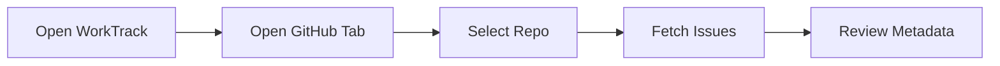
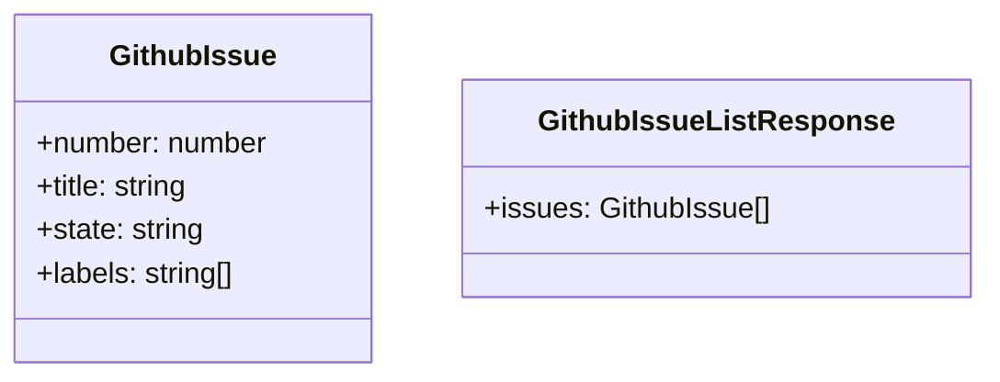

# GitHub Project Tracking and Feature Backlog Implementation Plan

> **For agentic workers:** REQUIRED: Use the `subagent-driven-development` agent (recommended) or `executing-plans` agent to implement this plan task-by-task. Steps use checkbox (`- [ ]`) syntax for tracking.

**Goal:** Add GitHub issue/project tracking to WorkTrack, let users start timers from GitHub issues, support creating GitHub issues from WorkTrack, and formalize a feature-doc-to-GitHub-issue workflow.

**Architecture:** Add a server-side GitHub integration boundary implemented with SvelteKit API routes that shell out to `gh` for reads/writes. Add a client-side GitHub store and panel that normalize issue metadata and bridge issue selection into existing `tracker.startTimer(...)` behavior without rewriting timer logic. Add feature spec files under `.local/features/` (with Mermaid diagrams) as the source for backlog review and later `gh issue create` operations.

**Tech Stack:** Svelte 5, SvelteKit endpoints, TypeScript, Vitest, vitest-browser-svelte, Playwright, GitHub CLI (`gh`)

---

## Scope Check

This plan covers one cohesive subsystem: GitHub tracking and the feature-backlog workflow that feeds it. It does not include shipping every non-GitHub UX feature implementation now; those are captured as backlog specs for later issue-by-issue delivery.

## File Structure

### New files
- Create: `.local/features/github-issues-metadata-listing.md`
  - Source-of-truth feature spec for listing GitHub issues with full metadata in WorkTrack.
- Create: `.local/features/github-start-timer-from-issue.md`
  - Source-of-truth feature spec for starting a timer directly from a GitHub issue row.
- Create: `.local/features/github-create-issue-from-worktrack.md`
  - Source-of-truth feature spec for creating an issue (Issue only vs Issue + Project).
- Create: `.local/features/github-optional-writeback-actions.md`
  - Source-of-truth feature spec for optional write-back actions (comments/status sync).
- Create: `.local/features/logs-advanced-filters-and-search.md`
  - Backlog spec for logs UX improvements.
- Create: `.local/features/reports-export-csv-pdf.md`
  - Backlog spec for report export UX.
- Create: `.local/features/keyboard-shortcuts-and-command-palette.md`
  - Backlog spec for interaction speed/UX improvements.
- Create: `src/lib/github/types.ts`
  - Canonical GitHub domain types used by API, store, and UI.
- Create: `src/lib/github/normalize.ts`
  - Normalizes `gh` JSON output into app-friendly issue metadata shape.
- Create: `src/lib/github/normalize.spec.ts`
  - Unit tests for metadata normalization.
- Create: `src/lib/feature-docs/feature-docs.spec.ts`
  - Validates that every `.local/features/*.md` file follows the required template sections.
- Create: `src/lib/feature-docs/agents-policy.spec.ts`
  - Validates that `AGENTS.md` contains required workflow constraints.
- Create: `src/lib/stores/github.svelte.ts`
  - Client-side state for issue listing, filters, loading/error, and actions.
- Create: `src/lib/stores/github.svelte.spec.ts`
  - Unit tests for filtering/state transitions.
- Create: `src/lib/components/GithubIssuesPanel.svelte`
  - UI panel to browse issues and start timer / create issue.
- Create: `src/lib/components/GithubIssueCreateModal.svelte`
  - Modal for creating issue with per-action destination option.
- Create: `src/lib/components/GithubIssuesPanel.svelte.spec.ts`
  - Component tests for metadata rendering and click behavior.
- Create: `src/lib/server/github/ghClient.ts`
  - `gh` command wrapper with typed helpers and error mapping.
- Create: `src/lib/server/github/ghClient.spec.ts`
  - Unit tests for command invocation and parse errors.
- Create: `src/routes/api/github/issues/+server.ts`
  - GET endpoint to list issues + metadata.
- Create: `src/routes/api/github/issues/+server.spec.ts`
  - Endpoint tests for success/error/retry payloads.
- Create: `src/routes/api/github/issues/create/+server.ts`
  - POST endpoint to create issue and optionally add to project.
- Create: `src/routes/api/github/issues/create/+server.spec.ts`
  - Endpoint tests for issue-only and issue+project flows.
- Create: `src/routes/github-tracking.e2e.ts`
  - Playwright E2E tests for the main user journey.

### Existing files to modify
- Modify: `src/lib/components/NavBar.svelte`
  - Add a GitHub tab.
- Modify: `src/routes/+page.svelte`
  - Render `GithubIssuesPanel` when GitHub tab active.
- Modify: `src/lib/stores/tracker.svelte.ts`
  - Add a small helper for issue-to-task bridging metadata-safe start behavior (no core timer rewrite).
- Modify: `AGENTS.md`
  - Add workflow constraints: `.local/features`, Mermaid requirement, TDD-first, feature branches, `gh` preference, no secrets in chat, user runs `git push`.

---

### Task 1: Create Feature Spec Files in `.local/features`

**Files:**
- Create: `.local/features/github-issues-metadata-listing.md`
- Create: `.local/features/github-start-timer-from-issue.md`
- Create: `.local/features/github-create-issue-from-worktrack.md`
- Create: `.local/features/github-optional-writeback-actions.md`
- Create: `.local/features/logs-advanced-filters-and-search.md`
- Create: `.local/features/reports-export-csv-pdf.md`
- Create: `.local/features/keyboard-shortcuts-and-command-palette.md`

- [ ] **Step 1: Write a failing validation test for feature docs structure**

```ts
// src/lib/feature-docs/feature-docs.spec.ts
import { describe, it, expect } from 'vitest';
import { readFileSync } from 'node:fs';

const files = [
  '.local/features/github-issues-metadata-listing.md',
  '.local/features/github-start-timer-from-issue.md',
  '.local/features/github-create-issue-from-worktrack.md',
  '.local/features/github-optional-writeback-actions.md',
  '.local/features/logs-advanced-filters-and-search.md',
  '.local/features/reports-export-csv-pdf.md',
  '.local/features/keyboard-shortcuts-and-command-palette.md'
];

describe('feature docs template compliance', () => {
  for (const file of files) {
    it(`${file} has required sections and mermaid blocks`, () => {
      const text = readFileSync(file, 'utf8');
      expect(text).toContain('## Brief Description');
      expect(text).toContain('## User Story');
      expect(text).toContain('## User Benefits');
      expect(text).toContain('## Acceptance Criteria');
      expect(text).toContain('## Rough Complexity Estimate');
      expect(text).toContain('## TDD Test Cases');
      expect(text).toContain('## Mermaid: User Journey');
      expect(text).toContain('## Mermaid: System Placement');
      expect(text).toContain('## Mermaid: Module Structure');
      expect((text.match(/```mermaid/g) ?? []).length).toBeGreaterThanOrEqual(3);
    });
  }
});
```

- [ ] **Step 2: Run test to verify it fails**

Run: `bun run test:unit -- src/lib/feature-docs/feature-docs.spec.ts`
Expected: FAIL with file-not-found or missing section assertions.

- [ ] **Step 3: Create all feature docs with full required content**

```md
# Feature: GitHub Issues Metadata Listing

## Brief Description
Display all issues from a selected GitHub repository and optional GitHub Project with full metadata usable by delivery teams.

## User Story
As a delivery manager, I want to browse issues and their metadata in WorkTrack, so that I can start work without switching tools.

## User Benefits
- Reduced context switching between GitHub and WorkTrack
- Faster issue triage and assignment
- Better visibility into labels, assignees, milestones, and status

## Acceptance Criteria
- [ ] User can load issues for selected owner/repo
- [ ] User sees metadata: number, title, state, labels, assignees, milestone, created/updated timestamps, URL
- [ ] Loading, empty, and error states are clear and actionable

## Rough Complexity Estimate
Medium

## TDD Test Cases
### Unit Tests
- Normalize raw issue JSON into typed app model
- Preserve null-safe metadata fields

### Component Tests
- Render metadata chips and links
- Render retry UI on error

### E2E Tests
- Load list and verify metadata visibility
- Retry after simulated failure

## Mermaid: User Journey


## Mermaid: System Placement
```mermaid
graph TD
  UI[GithubIssuesPanel] --> Store[github.svelte.ts]
  Store --> API[/api/github/issues]
  API --> GH[gh CLI]
```

## Mermaid: Module Structure

```

- [ ] **Step 4: Run test to verify it passes**

Run: `bun run test:unit -- src/lib/feature-docs/feature-docs.spec.ts`
Expected: PASS.

- [ ] **Step 5: Commit**

```bash
git add .local/features src/lib/feature-docs/feature-docs.spec.ts
git commit -m "docs: add structured feature specs with mermaid and tdd cases"
```

### Task 2: Add GitHub Domain Types and Normalization

**Files:**
- Create: `src/lib/github/types.ts`
- Create: `src/lib/github/normalize.ts`
- Create: `src/lib/github/normalize.spec.ts`

- [ ] **Step 1: Write failing normalization tests**

```ts
import { describe, it, expect } from 'vitest';
import { normalizeIssue } from './normalize';

describe('normalizeIssue', () => {
  it('maps gh JSON issue to app model with metadata', () => {
    const raw = {
      number: 42,
      title: 'Add sync',
      state: 'OPEN',
      labels: [{ name: 'feature' }],
      assignees: [{ login: 'tom' }],
      milestone: { title: 'v1' },
      createdAt: '2026-04-20T10:00:00Z',
      updatedAt: '2026-04-21T10:00:00Z',
      url: 'https://github.com/acme/repo/issues/42'
    };

    const issue = normalizeIssue(raw);

    expect(issue.number).toBe(42);
    expect(issue.labels).toEqual(['feature']);
    expect(issue.assignees).toEqual(['tom']);
    expect(issue.milestone).toBe('v1');
  });

  it('handles optional metadata as empty values', () => {
    const issue = normalizeIssue({ number: 1, title: 'A', state: 'OPEN', labels: [], assignees: [] });
    expect(issue.milestone).toBeNull();
    expect(issue.labels).toEqual([]);
    expect(issue.assignees).toEqual([]);
  });
});
```

- [ ] **Step 2: Run test to verify it fails**

Run: `bun run test:unit -- src/lib/github/normalize.spec.ts`
Expected: FAIL with module/function not found.

- [ ] **Step 3: Implement minimal types and normalizer**

```ts
// src/lib/github/types.ts
export interface GithubIssue {
  number: number;
  title: string;
  state: 'OPEN' | 'CLOSED';
  labels: string[];
  assignees: string[];
  milestone: string | null;
  createdAt: string | null;
  updatedAt: string | null;
  url: string;
}

// src/lib/github/normalize.ts
import type { GithubIssue } from './types';

export function normalizeIssue(raw: any): GithubIssue {
  return {
    number: Number(raw.number),
    title: String(raw.title ?? ''),
    state: raw.state === 'CLOSED' ? 'CLOSED' : 'OPEN',
    labels: Array.isArray(raw.labels) ? raw.labels.map((l: any) => String(l.name ?? '')).filter(Boolean) : [],
    assignees: Array.isArray(raw.assignees) ? raw.assignees.map((a: any) => String(a.login ?? '')).filter(Boolean) : [],
    milestone: raw.milestone?.title ? String(raw.milestone.title) : null,
    createdAt: raw.createdAt ? String(raw.createdAt) : null,
    updatedAt: raw.updatedAt ? String(raw.updatedAt) : null,
    url: String(raw.url ?? '')
  };
}
```

- [ ] **Step 4: Run test to verify it passes**

Run: `bun run test:unit -- src/lib/github/normalize.spec.ts`
Expected: PASS.

- [ ] **Step 5: Commit**

```bash
git add src/lib/github/types.ts src/lib/github/normalize.ts src/lib/github/normalize.spec.ts
git commit -m "feat: add github issue types and normalization"
```

### Task 3: Build `gh` Command Wrapper and API Contract Tests

**Files:**
- Create: `src/lib/server/github/ghClient.ts`
- Create: `src/lib/server/github/ghClient.spec.ts`

- [ ] **Step 1: Write failing tests for command invocation and error mapping**

```ts
import { describe, it, expect, vi } from 'vitest';
import { runGhJson } from './ghClient';

describe('runGhJson', () => {
  it('parses stdout as JSON', async () => {
    const exec = vi.fn().mockResolvedValue({ stdout: '[{"number":1}]', stderr: '' });
    const result = await runGhJson(['issue', 'list'], exec);
    expect(result).toEqual([{ number: 1 }]);
  });

  it('throws readable error for invalid JSON', async () => {
    const exec = vi.fn().mockResolvedValue({ stdout: 'not-json', stderr: '' });
    await expect(runGhJson(['issue', 'list'], exec)).rejects.toThrow('Invalid gh JSON response');
  });
});
```

- [ ] **Step 2: Run test to verify it fails**

Run: `bun run test:unit -- src/lib/server/github/ghClient.spec.ts`
Expected: FAIL with missing module.

- [ ] **Step 3: Implement minimal `gh` wrapper**

```ts
import { execFile } from 'node:child_process';
import { promisify } from 'node:util';

const execFileAsync = promisify(execFile);

type ExecLike = (args: string[]) => Promise<{ stdout: string; stderr: string }>;

export async function runGhJson(args: string[], execLike?: (args: string[]) => Promise<{ stdout: string; stderr: string }>) {
  const runner = execLike ?? ((a: string[]) => execFileAsync('gh', a));
  const { stdout } = await runner(args);
  try {
    return JSON.parse(stdout);
  } catch {
    throw new Error('Invalid gh JSON response');
  }
}
```

- [ ] **Step 4: Run test to verify it passes**

Run: `bun run test:unit -- src/lib/server/github/ghClient.spec.ts`
Expected: PASS.

- [ ] **Step 5: Commit**

```bash
git add src/lib/server/github/ghClient.ts src/lib/server/github/ghClient.spec.ts
git commit -m "feat: add gh client wrapper with typed error handling"
```

### Task 4: Implement GET `/api/github/issues` Endpoint

**Files:**
- Create: `src/routes/api/github/issues/+server.ts`
- Create: `src/routes/api/github/issues/+server.spec.ts`
- Modify: `src/lib/github/normalize.ts`

- [ ] **Step 1: Write failing endpoint tests**

```ts
import { describe, it, expect, vi } from 'vitest';
import { GET } from './+server';

describe('GET /api/github/issues', () => {
  it('returns normalized issues', async () => {
    const event = { url: new URL('http://localhost/api/github/issues?owner=acme&repo=tracker') } as any;
    const response = await GET(event);
    expect(response.status).toBe(200);
  });

  it('returns 400 when owner/repo are missing', async () => {
    const event = { url: new URL('http://localhost/api/github/issues') } as any;
    const response = await GET(event);
    expect(response.status).toBe(400);
  });
});
```

- [ ] **Step 2: Run test to verify it fails**

Run: `bun run test:unit -- src/routes/api/github/issues/+server.spec.ts`
Expected: FAIL with missing endpoint.

- [ ] **Step 3: Implement endpoint**

```ts
import { json } from '@sveltejs/kit';
import { runGhJson } from '$lib/server/github/ghClient';
import { normalizeIssue } from '$lib/github/normalize';

export async function GET(event: any) {
  const owner = event.url.searchParams.get('owner')?.trim();
  const repo = event.url.searchParams.get('repo')?.trim();

  if (!owner || !repo) {
    return json({ error: 'owner and repo are required' }, { status: 400 });
  }

  try {
    const raw = await runGhJson([
      'issue',
      'list',
      '--repo',
      `${owner}/${repo}`,
      '--json',
      'number,title,state,labels,assignees,milestone,createdAt,updatedAt,url'
    ]);
    const issues = Array.isArray(raw) ? raw.map(normalizeIssue) : [];
    return json({ issues });
  } catch (error: any) {
    return json({ error: error.message ?? 'Failed to fetch issues' }, { status: 502 });
  }
}
```

- [ ] **Step 4: Run test to verify it passes**

Run: `bun run test:unit -- src/routes/api/github/issues/+server.spec.ts`
Expected: PASS.

- [ ] **Step 5: Commit**

```bash
git add src/routes/api/github/issues/+server.ts src/routes/api/github/issues/+server.spec.ts src/lib/github/normalize.ts
git commit -m "feat: add github issues api endpoint"
```

### Task 5: Implement POST `/api/github/issues/create` Endpoint

**Files:**
- Create: `src/routes/api/github/issues/create/+server.ts`
- Create: `src/routes/api/github/issues/create/+server.spec.ts`
- Modify: `src/lib/server/github/ghClient.ts`

- [ ] **Step 1: Write failing tests for issue-only and issue+project flows**

```ts
import { describe, it, expect } from 'vitest';
import { POST } from './+server';

describe('POST /api/github/issues/create', () => {
  it('creates issue only', async () => {
    const body = { owner: 'acme', repo: 'tracker', title: 'New task', mode: 'issue-only' };
    const request = new Request('http://localhost/api/github/issues/create', { method: 'POST', body: JSON.stringify(body) });
    const response = await POST({ request } as any);
    expect([200, 201]).toContain(response.status);
  });

  it('creates issue and adds to project', async () => {
    const body = { owner: 'acme', repo: 'tracker', title: 'New task', mode: 'issue-and-project', projectId: 'PVT_xxx' };
    const request = new Request('http://localhost/api/github/issues/create', { method: 'POST', body: JSON.stringify(body) });
    const response = await POST({ request } as any);
    expect([200, 201]).toContain(response.status);
  });
});
```

- [ ] **Step 2: Run test to verify it fails**

Run: `bun run test:unit -- src/routes/api/github/issues/create/+server.spec.ts`
Expected: FAIL with missing endpoint.

- [ ] **Step 3: Implement endpoint and `gh` create helpers**

```ts
// +server.ts
import { json } from '@sveltejs/kit';
import { createGithubIssue } from '$lib/server/github/ghClient';

export async function POST(event: any) {
  const payload = await event.request.json();

  if (!payload?.owner || !payload?.repo || !payload?.title || !payload?.mode) {
    return json({ error: 'owner, repo, title, and mode are required' }, { status: 400 });
  }

  const result = await createGithubIssue(payload);
  return json(result, { status: 201 });
}

// ghClient.ts helper used above
export async function createGithubIssue(payload: {
  owner: string;
  repo: string;
  title: string;
  body?: string;
  mode: 'issue-only' | 'issue-and-project';
  projectId?: string;
}) {
  const issue = await runGhJson([
    'issue',
    'create',
    '--repo',
    `${payload.owner}/${payload.repo}`,
    '--title',
    payload.title,
    '--body',
    payload.body ?? '',
    '--json',
    'number,title,url'
  ]);

  if (payload.mode === 'issue-and-project' && payload.projectId) {
    await runGhJson([
      'project',
      'item-add',
      '--id',
      payload.projectId,
      '--url',
      issue.url,
      '--format',
      'json'
    ]);
  }

  return {
    number: issue.number,
    title: issue.title,
    url: issue.url,
    mode: payload.mode
  };
}
```

- [ ] **Step 4: Run test to verify it passes**

Run: `bun run test:unit -- src/routes/api/github/issues/create/+server.spec.ts`
Expected: PASS.

- [ ] **Step 5: Commit**

```bash
git add src/routes/api/github/issues/create/+server.ts src/routes/api/github/issues/create/+server.spec.ts src/lib/server/github/ghClient.ts
git commit -m "feat: add github issue creation endpoint with optional project assignment"
```

### Task 6: Build GitHub Store with Filtering and Retry States

**Files:**
- Create: `src/lib/stores/github.svelte.ts`
- Create: `src/lib/stores/github.svelte.spec.ts`

- [ ] **Step 1: Write failing store tests**

```ts
import { describe, it, expect } from 'vitest';
import { createGithubStore } from './github.svelte';

describe('github store', () => {
  it('filters issues by free-text query', () => {
    const store = createGithubStore();
    store.setIssues([
      { number: 1, title: 'Fix timer start', state: 'OPEN', labels: [], assignees: [], milestone: null, createdAt: null, updatedAt: null, url: 'u1' },
      { number: 2, title: 'Improve reports', state: 'OPEN', labels: [], assignees: [], milestone: null, createdAt: null, updatedAt: null, url: 'u2' }
    ]);
    store.setQuery('timer');
    expect(store.filteredIssues.length).toBe(1);
    expect(store.filteredIssues[0].number).toBe(1);
  });

  it('tracks loading and error state transitions', async () => {
    const store = createGithubStore();
    store.startLoading();
    expect(store.loading).toBe(true);
    store.setError('failed');
    expect(store.loading).toBe(false);
    expect(store.error).toBe('failed');
  });
});
```

- [ ] **Step 2: Run test to verify it fails**

Run: `bun run test:unit -- src/lib/stores/github.svelte.spec.ts`
Expected: FAIL with missing store API.

- [ ] **Step 3: Implement minimal store**

```ts
import type { GithubIssue } from '$lib/github/types';

export function createGithubStore() {
  let issues = $state<GithubIssue[]>([]);
  let query = $state('');
  let loading = $state(false);
  let error = $state<string | null>(null);

  const filteredIssues = $derived.by(() => {
    const q = query.trim().toLowerCase();
    if (!q) return issues;
    return issues.filter((i) => `${i.number} ${i.title} ${i.labels.join(' ')} ${i.assignees.join(' ')}`.toLowerCase().includes(q));
  });

  return {
    get issues() { return issues; },
    get filteredIssues() { return filteredIssues; },
    get loading() { return loading; },
    get error() { return error; },
    setIssues(next: GithubIssue[]) { issues = next; error = null; },
    setQuery(next: string) { query = next; },
    startLoading() { loading = true; error = null; },
    setError(message: string) { loading = false; error = message; },
    endLoading() { loading = false; }
  };
}

export const githubStore = createGithubStore();
```

- [ ] **Step 4: Run test to verify it passes**

Run: `bun run test:unit -- src/lib/stores/github.svelte.spec.ts`
Expected: PASS.

- [ ] **Step 5: Commit**

```bash
git add src/lib/stores/github.svelte.ts src/lib/stores/github.svelte.spec.ts
git commit -m "feat: add github issues client store with filters and retry state"
```

### Task 7: Build GitHub Issues UI and Timer Bridge

**Files:**
- Create: `src/lib/components/GithubIssuesPanel.svelte`
- Create: `src/lib/components/GithubIssueCreateModal.svelte`
- Create: `src/lib/components/GithubIssuesPanel.svelte.spec.ts`
- Modify: `src/lib/stores/tracker.svelte.ts`
- Modify: `src/lib/components/NavBar.svelte`
- Modify: `src/routes/+page.svelte`

- [ ] **Step 1: Write failing component tests**

```ts
import { page } from 'vitest/browser';
import { describe, it, expect, vi } from 'vitest';
import { render } from 'vitest-browser-svelte';
import GithubIssuesPanel from './GithubIssuesPanel.svelte';

describe('GithubIssuesPanel', () => {
  it('renders issue metadata and start button', async () => {
    render(GithubIssuesPanel, {
      issues: [{ number: 7, title: 'Track issue', state: 'OPEN', labels: ['feature'], assignees: ['tom'], milestone: null, createdAt: null, updatedAt: null, url: 'https://github.com/x/y/issues/7' }]
    });

    await expect.element(page.getByText('#7')).toBeInTheDocument();
    await expect.element(page.getByRole('button', { name: /start/i })).toBeInTheDocument();
  });
});
```

- [ ] **Step 2: Run test to verify it fails**

Run: `bun run test:unit -- src/lib/components/GithubIssuesPanel.svelte.spec.ts`
Expected: FAIL with missing component.

- [ ] **Step 3: Implement panel, modal, and page wiring**

```svelte
<!-- GithubIssuesPanel.svelte (core idea) -->
<script lang="ts">
  import { tracker } from '$lib/stores/tracker.svelte';
  import { githubStore } from '$lib/stores/github.svelte';

  function startFromIssue(issue: { number: number; title: string }) {
    tracker.startTimer('GitHub', 'Issues', `#${issue.number} ${issue.title}`, tracker.state.currentUser);
  }
</script>

{#each githubStore.filteredIssues as issue (issue.number)}
  <article>
    <p>#{issue.number} {issue.title}</p>
    <button onclick={() => startFromIssue(issue)}>Start</button>
  </article>
{/each}
```

- [ ] **Step 4: Run test to verify it passes**

Run: `bun run test:unit -- src/lib/components/GithubIssuesPanel.svelte.spec.ts`
Expected: PASS.

- [ ] **Step 5: Commit**

```bash
git add src/lib/components/GithubIssuesPanel.svelte src/lib/components/GithubIssueCreateModal.svelte src/lib/components/GithubIssuesPanel.svelte.spec.ts src/lib/components/NavBar.svelte src/routes/+page.svelte src/lib/stores/tracker.svelte.ts
git commit -m "feat: add github panel and start-timer-from-issue workflow"
```

### Task 8: Add End-to-End Coverage for Core GitHub Journey

**Files:**
- Create: `src/routes/github-tracking.e2e.ts`

- [ ] **Step 1: Write E2E tests for list/start/create flows**

```ts
import { expect, test } from '@playwright/test';

test('user can open github tab and start timer from issue row', async ({ page }) => {
  await page.goto('/');
  await page.getByRole('button', { name: /github/i }).click();
  await expect(page.getByText(/issues/i)).toBeVisible();
  await page.getByRole('button', { name: /start/i }).first().click();
  await page.getByRole('button', { name: /timer/i }).click();
  await expect(page.getByText(/#\d+/)).toBeVisible();
});

test('user can create issue with mode selection', async ({ page }) => {
  await page.goto('/');
  await page.getByRole('button', { name: /github/i }).click();
  await page.getByRole('button', { name: /add github task/i }).click();
  await page.getByLabel(/title/i).fill('Track deployment prep');
  await page.getByLabel(/mode/i).selectOption('issue-and-project');
  await page.getByRole('button', { name: /create/i }).click();
  await expect(page.getByText(/created/i)).toBeVisible();
});
```

- [ ] **Step 2: Run E2E to verify it fails first**

Run: `bun run test:e2e -- src/routes/github-tracking.e2e.ts`
Expected: FAIL before UI/endpoint wiring is complete.

- [ ] **Step 3: Implement explicit selectors and accessible labels to satisfy E2E**

```ts
// NavBar.svelte
<button aria-label="GitHub" ...>GitHub</button>

// GithubIssuesPanel.svelte
<button aria-label={`Start #${issue.number}`} ...>Start</button>
<button aria-label="Add GitHub Task" ...>Add GitHub Task</button>

// GithubIssueCreateModal.svelte
<label for="issue-title">Title</label>
<input id="issue-title" ... />
<label for="create-mode">Mode</label>
<select id="create-mode" ...>
  <option value="issue-only">Issue only</option>
  <option value="issue-and-project">Issue + Project</option>
</select>
<button aria-label="Create" ...>Create</button>
```

- [ ] **Step 4: Run E2E to verify it passes**

Run: `bun run test:e2e -- src/routes/github-tracking.e2e.ts`
Expected: PASS.

- [ ] **Step 5: Commit**

```bash
git add src/routes/github-tracking.e2e.ts src/lib/components/GithubIssuesPanel.svelte src/lib/components/GithubIssueCreateModal.svelte
git commit -m "test: add e2e coverage for github tracking journeys"
```

### Task 9: Update `AGENTS.md` with Workflow Rules

**Files:**
- Modify: `AGENTS.md`

- [ ] **Step 1: Write a failing test that `AGENTS.md` includes required policy lines**

```ts
import { describe, it, expect } from 'vitest';
import { readFileSync } from 'node:fs';

describe('AGENTS policy', () => {
  it('includes branch, gh, tdd, and feature-doc rules', () => {
    const text = readFileSync('AGENTS.md', 'utf8');
    expect(text).toContain('.local/features');
    expect(text).toContain('feature branch workflow');
    expect(text).toContain('TDD');
    expect(text).toContain('gh');
    expect(text).toContain('No requests for secrets in chat');
    expect(text).toContain('ask me to issue the command on the terminal');
    expect(text).toContain('Mermaid');
  });
});
```

- [ ] **Step 2: Run test to verify it fails**

Run: `bun run test:unit -- src/lib/feature-docs/agents-policy.spec.ts`
Expected: FAIL with missing expected policy strings.

- [ ] **Step 3: Update `AGENTS.md` with exact workflow contract**

```md
## Delivery Workflow Rules
- Capture feature proposals in `.local/features/<feature-name>.md`.
- Each feature doc must include:
  - Brief description
  - User Story
  - User benefits
  - Acceptance criteria
  - Rough complexity estimate (low/medium/high)
  - TDD test cases
  - Mermaid diagrams for user journey, system placement, and module structure
- Use feature branch workflow (`feature/<feature-name>`).
- Follow TDD for implementation.
- Use `gh` wherever possible for GitHub operations.
- No requests for secrets in chat.
- For operations such as `git push`, ask Tom to run the command in terminal.
```

- [ ] **Step 4: Run test to verify it passes**

Run: `bun run test:unit -- src/lib/feature-docs/agents-policy.spec.ts`
Expected: PASS.

- [ ] **Step 5: Commit**

```bash
git add AGENTS.md src/lib/feature-docs/agents-policy.spec.ts
git commit -m "docs: codify delivery workflow in AGENTS"
```

### Task 10: Review Backlog Docs and Create GitHub Issues with `gh`

**Files:**
- Modify: none (terminal workflow)

- [ ] **Step 1: Verify feature files are present and complete**

Run: `ls .local/features`
Expected: 7 feature markdown files visible.

- [ ] **Step 2: Create issues from each feature file using `gh`**

Run one command per file:

```bash
gh issue create --title "Feature: GitHub Issues Metadata Listing" --body-file .local/features/github-issues-metadata-listing.md
```

Expected: command prints created issue URL.

- [ ] **Step 3: Add labels and project as needed**

Run:

```bash
gh issue edit <issue-number> --add-label "feature,needs-tdd"
```

Expected: issue labels updated.

- [ ] **Step 4: Confirm issue creation summary**

Run: `gh issue list --limit 20`
Expected: newly created feature issues listed.

- [ ] **Step 5: Commit local workflow artifacts (if any) and ask Tom to push**

```bash
git status
git add .
git commit -m "chore: sync local feature backlog and issue references"
```

Then ask Tom to run push in terminal:

```bash
git push -u origin feature/github-project-tracking
```

---

## Verification Matrix

Run the following before opening PR:

```bash
bun run check
bun run lint
bun run test:unit -- --run
bun run test:e2e
```

Expected:
- Type checks pass
- Lint passes
- Unit tests pass
- E2E tests pass

## PR Preparation Checklist

- [ ] Feature docs exist and pass template validation tests
- [ ] GitHub issue list/load/create flows tested
- [ ] Start timer from issue flow tested end-to-end
- [ ] AGENTS workflow rules updated
- [ ] No secrets added to repo or chat logs
- [ ] `gh` issue links included in PR description
